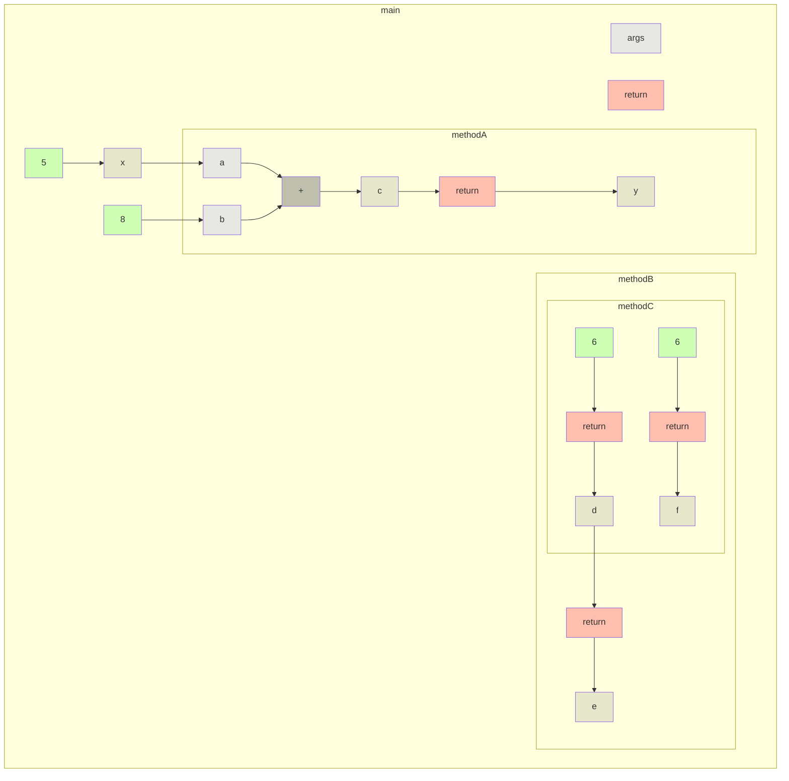

```mermaid
flowchart TD
  subgraph main
    13677[args]:::FUNC_PARAM
    13681[x]:::VARIABLE
    13682[y]:::VARIABLE
    13693[e]:::VARIABLE
    232102[8]:::LITERAL
    364914[return]:::RETURN
    764292[5]:::LITERAL
    13681[x]:::VARIABLE --> 13701[a]:::FUNC_PARAM
    232102[8]:::LITERAL --> 13702[b]:::FUNC_PARAM
    764292[5]:::LITERAL --> 13681[x]:::VARIABLE
    subgraph methodA
      13701[a]:::FUNC_PARAM
      13702[b]:::FUNC_PARAM
      13703[c]:::VARIABLE
      594709[return]:::RETURN
      785695[+]:::BIN_OP
      13701[a]:::FUNC_PARAM --> 785695[+]:::BIN_OP
      13702[b]:::FUNC_PARAM --> 785695[+]:::BIN_OP
      13703[c]:::VARIABLE --> 594709[return]:::RETURN
      594709[return]:::RETURN --> 13682[y]:::VARIABLE
      785695[+]:::BIN_OP --> 13703[c]:::VARIABLE
    end
    subgraph methodB
      -894336856[d]:::VARIABLE
      -894336848[f]:::VARIABLE
      680146[return]:::RETURN
      -894336856[d]:::VARIABLE --> 680146[return]:::RETURN
      680146[return]:::RETURN --> 13693[e]:::VARIABLE
      subgraph methodC
        708522[return]:::RETURN
        713444[6]:::LITERAL
        708522[return]:::RETURN --> -894336856[d]:::VARIABLE
        713444[6]:::LITERAL --> 708522[return]:::RETURN
      end
      subgraph methodC
        183287[6]:::LITERAL
        875257[return]:::RETURN
        183287[6]:::LITERAL --> 875257[return]:::RETURN
        875257[return]:::RETURN --> -894336848[f]:::VARIABLE
      end
    end
  end
  classDef LITERAL fill:#00FF0030
  classDef VARIABLE fill:#80808030
  classDef BIN_OP fill:#80808080
  classDef FUNC_PARAM fill:#8080FF30
  classDef RETURN fill:#FF808080
```
