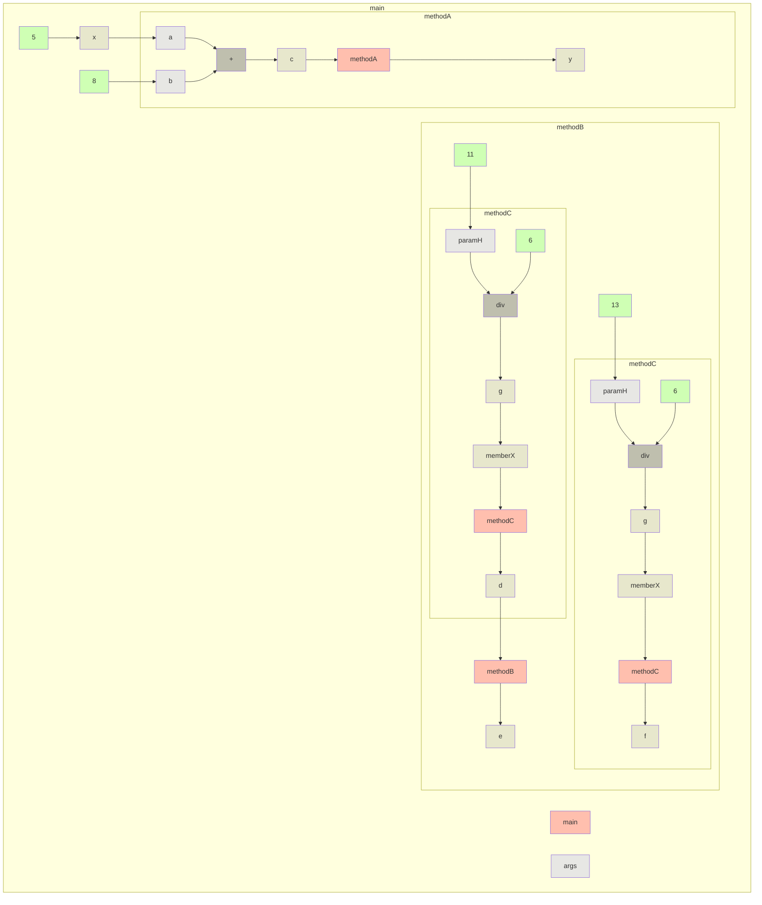

```mermaid
flowchart TD
  subgraph 4308940["main"]
    214598[x]:::VARIABLE
    217505[5]:::LITERAL
    221840[y]:::VARIABLE
    227960[8]:::LITERAL
    240574[e]:::VARIABLE
    56996632[main]:::RETURN
    1296531130[args]:::FUNC_PARAM
    214598[x]:::VARIABLE --> 1248129501[a]:::FUNC_PARAM
    217505[5]:::LITERAL --> 214598[x]:::VARIABLE
    227960[8]:::LITERAL --> 1248131541[b]:::FUNC_PARAM
    subgraph 4317894["methodA"]
      1248129501[a]:::FUNC_PARAM
      1248131541[b]:::FUNC_PARAM
      1347750956[c]:::VARIABLE
      1347754050[+]:::BIN_OP
      16244305365[methodA]:::RETURN
      1248129501[a]:::FUNC_PARAM --> 1347754050[+]:::BIN_OP
      1248131541[b]:::FUNC_PARAM --> 1347754050[+]:::BIN_OP
      1347750956[c]:::VARIABLE --> 16244305365[methodA]:::RETURN
      1347754050[+]:::BIN_OP --> 1347750956[c]:::VARIABLE
      16244305365[methodA]:::RETURN --> 221840[y]:::VARIABLE
    end
    subgraph 4320114["methodB"]
      1347775219[d]:::VARIABLE
      1347783634[f]:::VARIABLE
      1347804799[11]:::LITERAL
      1347813214[13]:::LITERAL
      16244322722[methodB]:::RETURN
      1347775219[d]:::VARIABLE --> 16244322722[methodB]:::RETURN
      1347804799[11]:::LITERAL --> -14324186260[paramH]:::FUNC_PARAM
      1347813214[13]:::LITERAL --> -14323876163[paramH]:::FUNC_PARAM
      16244322722[methodB]:::RETURN --> 240574[e]:::VARIABLE
      subgraph 4326256["methodC"]
        -14324186260[paramH]:::FUNC_PARAM
        1347811103[g]:::VARIABLE
        1347812582[6]:::LITERAL
        1349502705[div]:::BIN_OP
        17478815524[memberX]:::VARIABLE
        17591857401[methodC]:::RETURN
        -14324186260[paramH]:::FUNC_PARAM --> 1349502705[div]:::BIN_OP
        1347811103[g]:::VARIABLE --> 17478815524[memberX]:::VARIABLE
        1347812582[6]:::LITERAL --> 1349502705[div]:::BIN_OP
        1349502705[div]:::BIN_OP --> 1347811103[g]:::VARIABLE
        17478815524[memberX]:::VARIABLE --> 17591857401[methodC]:::RETURN
        17591857401[methodC]:::RETURN --> 1347775219[d]:::VARIABLE
      end
      subgraph 4327329["methodC"]
        -14323876163[paramH]:::FUNC_PARAM
        1347811195[g]:::VARIABLE
        1347812674[6]:::LITERAL
        1349502797[div]:::BIN_OP
        17478815616[memberX]:::VARIABLE
        17591865782[methodC]:::RETURN
        -14323876163[paramH]:::FUNC_PARAM --> 1349502797[div]:::BIN_OP
        1347811195[g]:::VARIABLE --> 17478815616[memberX]:::VARIABLE
        1347812674[6]:::LITERAL --> 1349502797[div]:::BIN_OP
        1349502797[div]:::BIN_OP --> 1347811195[g]:::VARIABLE
        17478815616[memberX]:::VARIABLE --> 17591865782[methodC]:::RETURN
        17591865782[methodC]:::RETURN --> 1347783634[f]:::VARIABLE
      end
    end
  end
  classDef LITERAL fill:#00FF0030
  classDef VARIABLE fill:#80808030
  classDef BIN_OP fill:#80808080
  classDef FUNC_PARAM fill:#8080FF30
  classDef RETURN fill:#FF808080
```
