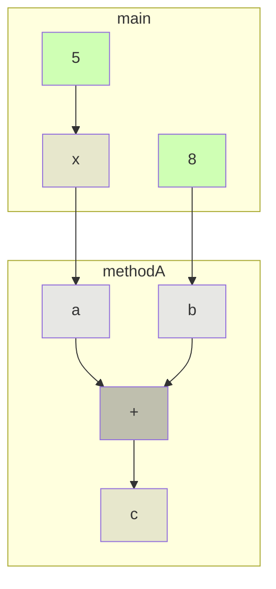

```mermaid
flowchart TD
  subgraph methodA
    13[a]:::FUNC_PARAM --> 16[+]:::BIN_OP
    14[b]:::FUNC_PARAM --> 16[+]:::BIN_OP
    16[+]:::BIN_OP --> 15[c]:::VARIABLE
  end
  subgraph main
    9[x]:::VARIABLE --> 13[a]:::FUNC_PARAM
    10[5]:::LITERAL --> 9[x]:::VARIABLE
    12[8]:::LITERAL --> 14[b]:::FUNC_PARAM
  end
  classDef LITERAL fill:#00FF0030
  classDef VARIABLE fill:#80808030
  classDef BIN_OP fill:#80808080
  classDef FUNC_PARAM fill:#8080FF30
  classDef RETURN fill:#FF808080
```
