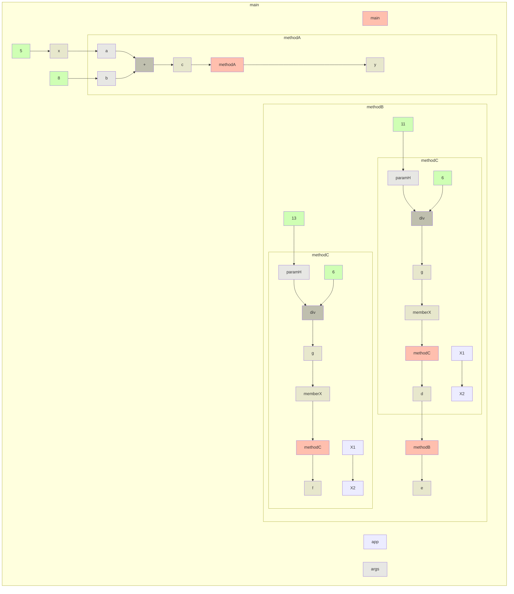

```mermaid
flowchart TD
  subgraph 4309014["main"]
    -1177365738[x]:::VARIABLE
    -1177362286[5]:::LITERAL
    -1177337819[y]:::VARIABLE
    -1177311145[8]:::LITERAL
    -1177277610[e]:::VARIABLE
    -1175662633[app]:::OBJ_VARIABLE
    -1126409814[args]:::FUNC_PARAM
    56853577[main]:::RETURN
    -1177365738[x]:::VARIABLE --> 11588793[a]:::FUNC_PARAM
    -1177362286[5]:::LITERAL --> -1177365738[x]:::VARIABLE
    -1177311145[8]:::LITERAL --> 11590798[b]:::FUNC_PARAM
    subgraph -607755091["methodA"]
      11588793[a]:::FUNC_PARAM
      11590798[b]:::FUNC_PARAM
      11616637[c]:::VARIABLE
      11619625[+]:::BIN_OP
      15066746251[methodA]:::RETURN
      11588793[a]:::FUNC_PARAM --> 11619625[+]:::BIN_OP
      11590798[b]:::FUNC_PARAM --> 11619625[+]:::BIN_OP
      11616637[c]:::VARIABLE --> 15066746251[methodA]:::RETURN
      11619625[+]:::BIN_OP --> 11616637[c]:::VARIABLE
      15066746251[methodA]:::RETURN --> -1177337819[y]:::VARIABLE
    end
    subgraph -605583820["methodB"]
      13501146[d]:::VARIABLE
      13530101[f]:::VARIABLE
      13551082[11]:::LITERAL
      13580037[13]:::LITERAL
      15066804951[methodB]:::RETURN
      13501146[d]:::VARIABLE --> 15066804951[methodB]:::RETURN
      13551082[11]:::LITERAL --> -18649270098[paramH]:::FUNC_PARAM
      13580037[13]:::LITERAL --> -18648373547[paramH]:::FUNC_PARAM
      15066804951[methodB]:::RETURN --> -1177277610[e]:::VARIABLE
      subgraph 503533734["methodC"]
        -18649270098[paramH]:::FUNC_PARAM
        -1726965320[g]:::VARIABLE
        -1726964109[6]:::LITERAL
        -1726891030[X1]:::OBJ_VARIABLE
        -1726207591[X2]:::OBJ_VARIABLE
        -1725273956[div]:::BIN_OP
        16144489774[memberX]:::VARIABLE
        16257583090[methodC]:::RETURN
        -18649270098[paramH]:::FUNC_PARAM --> -1725273956[div]:::BIN_OP
        -1726965320[g]:::VARIABLE --> 16144489774[memberX]:::VARIABLE
        -1726964109[6]:::LITERAL --> -1725273956[div]:::BIN_OP
        -1726891030[X1]:::OBJ_VARIABLE --> -1726207591[X2]:::OBJ_VARIABLE
        -1725273956[div]:::BIN_OP --> -1726965320[g]:::VARIABLE
        16144489774[memberX]:::VARIABLE --> 16257583090[methodC]:::RETURN
        16257583090[methodC]:::RETURN --> 13501146[d]:::VARIABLE
      end
      subgraph 504603811["methodC"]
        -18648373547[paramH]:::FUNC_PARAM
        -1726068769[g]:::VARIABLE
        -1726067558[6]:::LITERAL
        -1725994479[X1]:::OBJ_VARIABLE
        -1725311040[X2]:::OBJ_VARIABLE
        -1724377405[div]:::BIN_OP
        16144518695[memberX]:::VARIABLE
        16257612011[methodC]:::RETURN
        -18648373547[paramH]:::FUNC_PARAM --> -1724377405[div]:::BIN_OP
        -1726068769[g]:::VARIABLE --> 16144518695[memberX]:::VARIABLE
        -1726067558[6]:::LITERAL --> -1724377405[div]:::BIN_OP
        -1725994479[X1]:::OBJ_VARIABLE --> -1725311040[X2]:::OBJ_VARIABLE
        -1724377405[div]:::BIN_OP --> -1726068769[g]:::VARIABLE
        16144518695[memberX]:::VARIABLE --> 16257612011[methodC]:::RETURN
        16257612011[methodC]:::RETURN --> 13530101[f]:::VARIABLE
      end
    end
  end
  classDef LITERAL fill:#00FF0030
  classDef VARIABLE fill:#80808030
  classDef BIN_OP fill:#80808080
  classDef FUNC_PARAM fill:#8080FF30
  classDef RETURN fill:#FF808080
```
