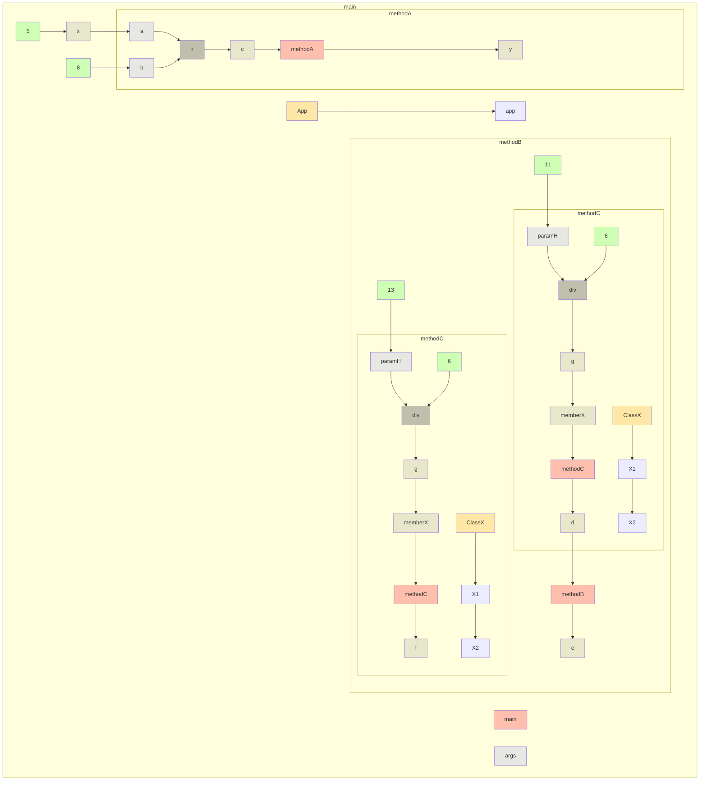

```mermaid
flowchart TD
  subgraph b0["main"]
    n1[main]:::RETURN
    n2[args]:::FUNC_PARAM
    n3[5]:::LITERAL
    n4[x]:::VARIABLE
    n5[8]:::LITERAL
    n12[y]:::VARIABLE
    n13[App]:::EXTERNAL
    n14[app]:::OBJ_VARIABLE
    n41[e]:::VARIABLE
    n3[5]:::LITERAL --> n4[x]:::VARIABLE
    n4[x]:::VARIABLE --> n8[a]:::FUNC_PARAM
    n5[8]:::LITERAL --> n9[b]:::FUNC_PARAM
    n13[App]:::EXTERNAL --> n14[app]:::OBJ_VARIABLE
    subgraph b6["methodA"]
      n7[methodA]:::RETURN
      n8[a]:::FUNC_PARAM
      n9[b]:::FUNC_PARAM
      n10[+]:::BIN_OP
      n11[c]:::VARIABLE
      n7[methodA]:::RETURN --> n12[y]:::VARIABLE
      n8[a]:::FUNC_PARAM --> n10[+]:::BIN_OP
      n9[b]:::FUNC_PARAM --> n10[+]:::BIN_OP
      n10[+]:::BIN_OP --> n11[c]:::VARIABLE
      n11[c]:::VARIABLE --> n7[methodA]:::RETURN
    end
    subgraph b15["methodB"]
      n16[methodB]:::RETURN
      n17[11]:::LITERAL
      n28[d]:::VARIABLE
      n29[13]:::LITERAL
      n40[f]:::VARIABLE
      n16[methodB]:::RETURN --> n41[e]:::VARIABLE
      n17[11]:::LITERAL --> n20[paramH]:::FUNC_PARAM
      n28[d]:::VARIABLE --> n16[methodB]:::RETURN
      n29[13]:::LITERAL --> n32[paramH]:::FUNC_PARAM
      subgraph b18["methodC"]
        n19[methodC]:::RETURN
        n20[paramH]:::FUNC_PARAM
        n21[6]:::LITERAL
        n22[div]:::BIN_OP
        n23[g]:::VARIABLE
        n24[ClassX]:::EXTERNAL
        n25[X1]:::OBJ_VARIABLE
        n26[memberX]:::VARIABLE
        n27[X2]:::OBJ_VARIABLE
        n19[methodC]:::RETURN --> n28[d]:::VARIABLE
        n20[paramH]:::FUNC_PARAM --> n22[div]:::BIN_OP
        n21[6]:::LITERAL --> n22[div]:::BIN_OP
        n22[div]:::BIN_OP --> n23[g]:::VARIABLE
        n23[g]:::VARIABLE --> n26[memberX]:::VARIABLE
        n24[ClassX]:::EXTERNAL --> n25[X1]:::OBJ_VARIABLE
        n25[X1]:::OBJ_VARIABLE --> n27[X2]:::OBJ_VARIABLE
        n26[memberX]:::VARIABLE --> n19[methodC]:::RETURN
      end
      subgraph b30["methodC"]
        n31[methodC]:::RETURN
        n32[paramH]:::FUNC_PARAM
        n33[6]:::LITERAL
        n34[div]:::BIN_OP
        n35[g]:::VARIABLE
        n36[ClassX]:::EXTERNAL
        n37[X1]:::OBJ_VARIABLE
        n38[memberX]:::VARIABLE
        n39[X2]:::OBJ_VARIABLE
        n31[methodC]:::RETURN --> n40[f]:::VARIABLE
        n32[paramH]:::FUNC_PARAM --> n34[div]:::BIN_OP
        n33[6]:::LITERAL --> n34[div]:::BIN_OP
        n34[div]:::BIN_OP --> n35[g]:::VARIABLE
        n35[g]:::VARIABLE --> n38[memberX]:::VARIABLE
        n36[ClassX]:::EXTERNAL --> n37[X1]:::OBJ_VARIABLE
        n37[X1]:::OBJ_VARIABLE --> n39[X2]:::OBJ_VARIABLE
        n38[memberX]:::VARIABLE --> n31[methodC]:::RETURN
      end
    end
  end
  classDef LITERAL fill:#00FF0030
  classDef VARIABLE fill:#80808030
  classDef BIN_OP fill:#80808080
  classDef FUNC_PARAM fill:#8080FF30
  classDef RETURN fill:#FF808080
  classDef EXTERNAL fill:#FFA50040
  classDef UNMODELLED fill:#FF000030,stroke-dasharray: 4 2
```
