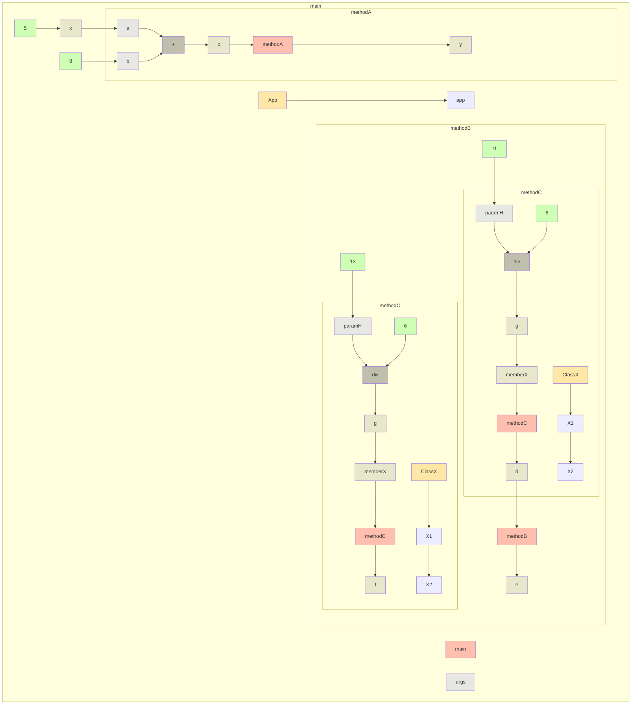

```mermaid
flowchart TD
  subgraph b0["main"]
    n1[main]:::RETURN
    n2[args]:::FUNC_PARAM
    n3[x]:::VARIABLE
    n4[5]:::LITERAL
    n5[y]:::VARIABLE
    n6[8]:::LITERAL
    n13[app]:::OBJ_VARIABLE
    n14[App]:::EXTERNAL
    n15[e]:::VARIABLE
    n3[x]:::VARIABLE --> n9[a]:::FUNC_PARAM
    n4[5]:::LITERAL --> n3[x]:::VARIABLE
    n6[8]:::LITERAL --> n10[b]:::FUNC_PARAM
    n14[App]:::EXTERNAL --> n13[app]:::OBJ_VARIABLE
    subgraph b7["methodA"]
      n8[methodA]:::RETURN
      n9[a]:::FUNC_PARAM
      n10[b]:::FUNC_PARAM
      n11[c]:::VARIABLE
      n12[+]:::BIN_OP
      n8[methodA]:::RETURN --> n5[y]:::VARIABLE
      n9[a]:::FUNC_PARAM --> n12[+]:::BIN_OP
      n10[b]:::FUNC_PARAM --> n12[+]:::BIN_OP
      n11[c]:::VARIABLE --> n8[methodA]:::RETURN
      n12[+]:::BIN_OP --> n11[c]:::VARIABLE
    end
    subgraph b16["methodB"]
      n17[methodB]:::RETURN
      n18[d]:::VARIABLE
      n19[11]:::LITERAL
      n30[f]:::VARIABLE
      n31[13]:::LITERAL
      n17[methodB]:::RETURN --> n15[e]:::VARIABLE
      n18[d]:::VARIABLE --> n17[methodB]:::RETURN
      n19[11]:::LITERAL --> n22[paramH]:::FUNC_PARAM
      n31[13]:::LITERAL --> n34[paramH]:::FUNC_PARAM
      subgraph b20["methodC"]
        n21[methodC]:::RETURN
        n22[paramH]:::FUNC_PARAM
        n23[g]:::VARIABLE
        n24[6]:::LITERAL
        n25[div]:::BIN_OP
        n26[X1]:::OBJ_VARIABLE
        n27[ClassX]:::EXTERNAL
        n28[memberX]:::VARIABLE
        n29[X2]:::OBJ_VARIABLE
        n21[methodC]:::RETURN --> n18[d]:::VARIABLE
        n22[paramH]:::FUNC_PARAM --> n25[div]:::BIN_OP
        n23[g]:::VARIABLE --> n28[memberX]:::VARIABLE
        n24[6]:::LITERAL --> n25[div]:::BIN_OP
        n25[div]:::BIN_OP --> n23[g]:::VARIABLE
        n26[X1]:::OBJ_VARIABLE --> n29[X2]:::OBJ_VARIABLE
        n27[ClassX]:::EXTERNAL --> n26[X1]:::OBJ_VARIABLE
        n28[memberX]:::VARIABLE --> n21[methodC]:::RETURN
      end
      subgraph b32["methodC"]
        n33[methodC]:::RETURN
        n34[paramH]:::FUNC_PARAM
        n35[g]:::VARIABLE
        n36[6]:::LITERAL
        n37[div]:::BIN_OP
        n38[X1]:::OBJ_VARIABLE
        n39[ClassX]:::EXTERNAL
        n40[memberX]:::VARIABLE
        n41[X2]:::OBJ_VARIABLE
        n33[methodC]:::RETURN --> n30[f]:::VARIABLE
        n34[paramH]:::FUNC_PARAM --> n37[div]:::BIN_OP
        n35[g]:::VARIABLE --> n40[memberX]:::VARIABLE
        n36[6]:::LITERAL --> n37[div]:::BIN_OP
        n37[div]:::BIN_OP --> n35[g]:::VARIABLE
        n38[X1]:::OBJ_VARIABLE --> n41[X2]:::OBJ_VARIABLE
        n39[ClassX]:::EXTERNAL --> n38[X1]:::OBJ_VARIABLE
        n40[memberX]:::VARIABLE --> n33[methodC]:::RETURN
      end
    end
  end
  classDef LITERAL fill:#00FF0030
  classDef VARIABLE fill:#80808030
  classDef BIN_OP fill:#80808080
  classDef FUNC_PARAM fill:#8080FF30
  classDef RETURN fill:#FF808080
  classDef EXTERNAL fill:#FFA50040
```
