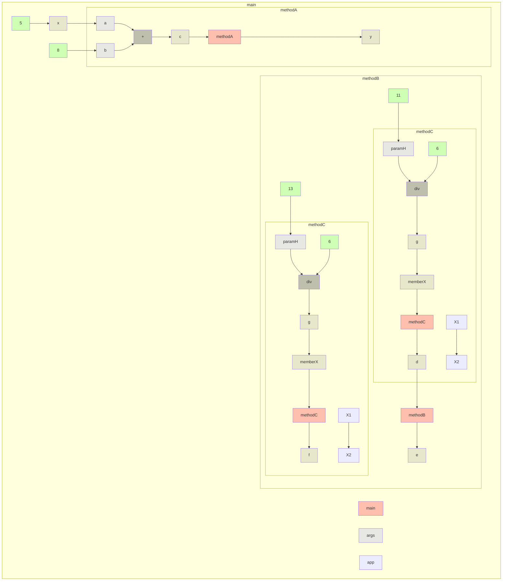

```mermaid
flowchart TD
  subgraph b0["main"]
    n1[main]:::RETURN
    n2[args]:::FUNC_PARAM
    n3[x]:::VARIABLE
    n4[5]:::LITERAL
    n5[y]:::VARIABLE
    n6[8]:::LITERAL
    n13[app]:::OBJ_VARIABLE
    n14[e]:::VARIABLE
    n3[x]:::VARIABLE --> n9[a]:::FUNC_PARAM
    n4[5]:::LITERAL --> n3[x]:::VARIABLE
    n6[8]:::LITERAL --> n10[b]:::FUNC_PARAM
    subgraph b7["methodA"]
      n8[methodA]:::RETURN
      n9[a]:::FUNC_PARAM
      n10[b]:::FUNC_PARAM
      n11[c]:::VARIABLE
      n12[+]:::BIN_OP
      n8[methodA]:::RETURN --> n5[y]:::VARIABLE
      n9[a]:::FUNC_PARAM --> n12[+]:::BIN_OP
      n10[b]:::FUNC_PARAM --> n12[+]:::BIN_OP
      n11[c]:::VARIABLE --> n8[methodA]:::RETURN
      n12[+]:::BIN_OP --> n11[c]:::VARIABLE
    end
    subgraph b15["methodB"]
      n16[methodB]:::RETURN
      n17[d]:::VARIABLE
      n18[11]:::LITERAL
      n28[f]:::VARIABLE
      n29[13]:::LITERAL
      n16[methodB]:::RETURN --> n14[e]:::VARIABLE
      n17[d]:::VARIABLE --> n16[methodB]:::RETURN
      n18[11]:::LITERAL --> n21[paramH]:::FUNC_PARAM
      n29[13]:::LITERAL --> n32[paramH]:::FUNC_PARAM
      subgraph b19["methodC"]
        n20[methodC]:::RETURN
        n21[paramH]:::FUNC_PARAM
        n22[g]:::VARIABLE
        n23[6]:::LITERAL
        n24[div]:::BIN_OP
        n25[X1]:::OBJ_VARIABLE
        n26[memberX]:::VARIABLE
        n27[X2]:::OBJ_VARIABLE
        n20[methodC]:::RETURN --> n17[d]:::VARIABLE
        n21[paramH]:::FUNC_PARAM --> n24[div]:::BIN_OP
        n22[g]:::VARIABLE --> n26[memberX]:::VARIABLE
        n23[6]:::LITERAL --> n24[div]:::BIN_OP
        n24[div]:::BIN_OP --> n22[g]:::VARIABLE
        n25[X1]:::OBJ_VARIABLE --> n27[X2]:::OBJ_VARIABLE
        n26[memberX]:::VARIABLE --> n20[methodC]:::RETURN
      end
      subgraph b30["methodC"]
        n31[methodC]:::RETURN
        n32[paramH]:::FUNC_PARAM
        n33[g]:::VARIABLE
        n34[6]:::LITERAL
        n35[div]:::BIN_OP
        n36[X1]:::OBJ_VARIABLE
        n37[memberX]:::VARIABLE
        n38[X2]:::OBJ_VARIABLE
        n31[methodC]:::RETURN --> n28[f]:::VARIABLE
        n32[paramH]:::FUNC_PARAM --> n35[div]:::BIN_OP
        n33[g]:::VARIABLE --> n37[memberX]:::VARIABLE
        n34[6]:::LITERAL --> n35[div]:::BIN_OP
        n35[div]:::BIN_OP --> n33[g]:::VARIABLE
        n36[X1]:::OBJ_VARIABLE --> n38[X2]:::OBJ_VARIABLE
        n37[memberX]:::VARIABLE --> n31[methodC]:::RETURN
      end
    end
  end
  classDef LITERAL fill:#00FF0030
  classDef VARIABLE fill:#80808030
  classDef BIN_OP fill:#80808080
  classDef FUNC_PARAM fill:#8080FF30
  classDef RETURN fill:#FF808080
  classDef EXTERNAL fill:#FFA50040
```
