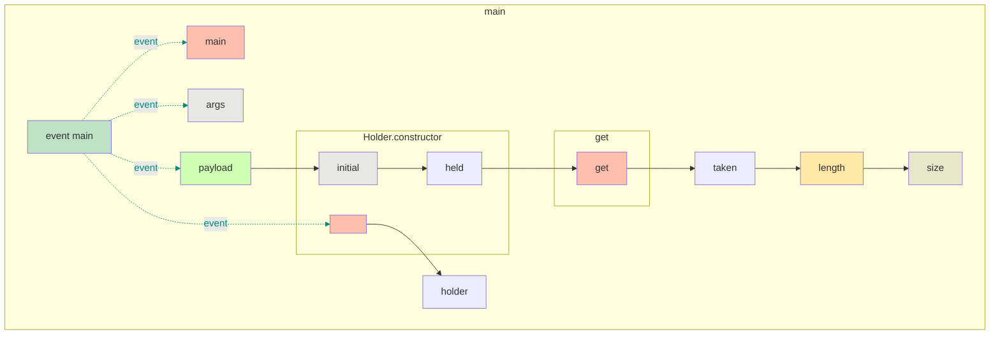

```mermaid
flowchart TD
  subgraph b0["main"]
    n1[event main]:::EVENT
    n2[main]:::RETURN
    n3[args]:::FUNC_PARAM
    n4["payload"]:::LITERAL
    n9[holder]:::OBJ_VARIABLE
    n12[taken]:::OBJ_VARIABLE
    n13[length]:::EXTERNAL
    n14[size]:::VARIABLE
    n1[event main]:::EVENT -. event .-> n2[main]:::RETURN
    n1[event main]:::EVENT -. event .-> n3[args]:::FUNC_PARAM
    n1[event main]:::EVENT -. event .-> n4["payload"]:::LITERAL
    n1[event main]:::EVENT -. event .-> n6[<init>]:::RETURN
    n4["payload"]:::LITERAL --> n7[initial]:::FUNC_PARAM
    n12[taken]:::OBJ_VARIABLE --> n13[length]:::EXTERNAL
    n13[length]:::EXTERNAL --> n14[size]:::VARIABLE
    n6[<init>]:::RETURN --> n9[holder]:::OBJ_VARIABLE
    n8[held]:::OBJ_VARIABLE --> n11[get]:::RETURN
    n11[get]:::RETURN --> n12[taken]:::OBJ_VARIABLE
    subgraph b5["Holder.constructor"]
      n6[<init>]:::RETURN
      n7[initial]:::FUNC_PARAM
      n8[held]:::OBJ_VARIABLE
      n7[initial]:::FUNC_PARAM --> n8[held]:::OBJ_VARIABLE
    end
    subgraph b10["get"]
      n11[get]:::RETURN
    end
  end
  linkStyle 0 stroke:#00897b,color:#00897b
  linkStyle 1 stroke:#00897b,color:#00897b
  linkStyle 2 stroke:#00897b,color:#00897b
  linkStyle 3 stroke:#00897b,color:#00897b
  classDef LITERAL fill:#00FF0030
  classDef VARIABLE fill:#80808030
  classDef BIN_OP fill:#80808080
  classDef FUNC_PARAM fill:#8080FF30
  classDef RETURN fill:#FF808080
  classDef EXTERNAL fill:#FFA50040
  classDef UNMODELLED fill:#FF000030,stroke-dasharray: 4 2
  classDef EVENT fill:#00897B40
```
