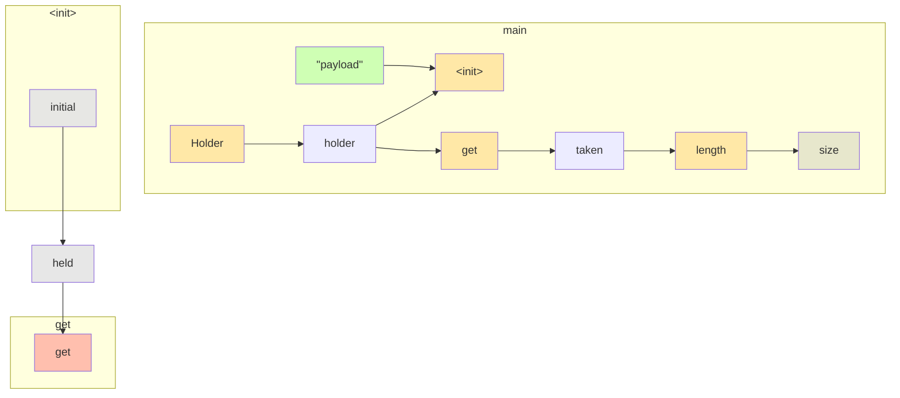

# generic: spike value graph (condensed)

```mermaid
flowchart TD
  subgraph m0["main"]
    n0["#lt;init#gt;"]:::EXTERNAL
    n1["Holder"]:::EXTERNAL
    n2["get"]:::EXTERNAL
    n3["length"]:::EXTERNAL
    n4["#quot;payload#quot;"]:::LITERAL
    n5["holder"]:::OBJ_VARIABLE
    n6["taken"]:::OBJ_VARIABLE
    n7["size"]:::VARIABLE
  end
  subgraph m1["#lt;init#gt;"]
    n8["initial"]:::FUNC_PARAM
  end
  subgraph m2["get"]
    n9["get"]:::RETURN
  end
  n10["held"]:::VARIABLE
  n1 --> n5
  n10 --> n9
  n2 --> n6
  n3 --> n7
  n4 --> n0
  n5 --> n0
  n5 --> n2
  n6 --> n3
  n8 --> n10
  classDef LITERAL fill:#00FF0030
  classDef VARIABLE fill:#80808030
  classDef BIN_OP fill:#80808080
  classDef FUNC_PARAM fill:#8080FF30
  classDef RETURN fill:#FF808080
  classDef EXTERNAL fill:#FFA50040
  classDef UNMODELLED fill:#FF000030,stroke-dasharray: 4 2
```
