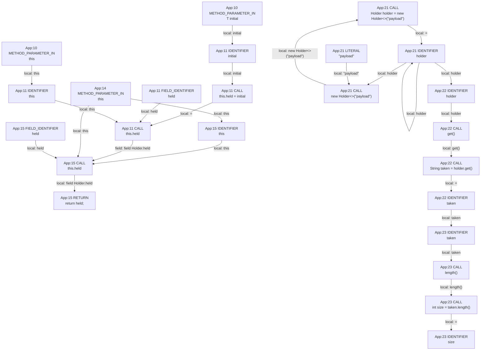

# generic: spike value graph

```mermaid
flowchart TD
  n0["App:10 METHOD_PARAMETER_IN<br/>T initial"]
  n1["App:10 METHOD_PARAMETER_IN<br/>this"]
  n2["App:11 CALL<br/>this.held"]
  n3["App:11 CALL<br/>this.held = initial"]
  n4["App:11 FIELD_IDENTIFIER<br/>held"]
  n5["App:11 IDENTIFIER<br/>initial"]
  n6["App:11 IDENTIFIER<br/>this"]
  n7["App:14 METHOD_PARAMETER_IN<br/>this"]
  n8["App:15 CALL<br/>this.held"]
  n9["App:15 FIELD_IDENTIFIER<br/>held"]
  n10["App:15 IDENTIFIER<br/>this"]
  n11["App:15 RETURN<br/>return held;"]
  n12["App:21 CALL<br/>Holder holder = new Holder#lt;#gt;(#quot;payload#quot;)"]
  n13["App:21 CALL<br/>new Holder#lt;#gt;(#quot;payload#quot;)"]
  n14["App:21 IDENTIFIER<br/>holder"]
  n15["App:21 LITERAL<br/>#quot;payload#quot;"]
  n16["App:22 CALL<br/>String taken = holder.get()"]
  n17["App:22 CALL<br/>get()"]
  n18["App:22 IDENTIFIER<br/>holder"]
  n19["App:22 IDENTIFIER<br/>taken"]
  n20["App:23 CALL<br/>int size = taken.length()"]
  n21["App:23 CALL<br/>length()"]
  n22["App:23 IDENTIFIER<br/>size"]
  n23["App:23 IDENTIFIER<br/>taken"]
  n0 -->|"local: initial"| n5
  n1 -->|"local: this"| n6
  n10 -->|"local: this"| n8
  n12 -->|"local: ="| n14
  n13 -->|"local: new Holder#lt;#gt;(#quot;payload#quot;)"| n12
  n14 -->|"local: holder"| n13
  n14 -->|"local: holder"| n14
  n14 -->|"local: holder"| n18
  n15 -->|"local: #quot;payload#quot;"| n13
  n16 -->|"local: ="| n19
  n17 -->|"local: get()"| n16
  n18 -->|"local: holder"| n17
  n19 -->|"local: taken"| n23
  n2 -->|"field: field Holder.held"| n8
  n20 -->|"local: ="| n22
  n21 -->|"local: length()"| n20
  n23 -->|"local: taken"| n21
  n3 -->|"local: ="| n2
  n4 -->|"local: held"| n2
  n5 -->|"local: initial"| n3
  n6 -->|"local: this"| n2
  n7 -->|"local: this"| n10
  n7 -->|"local: this"| n8
  n8 -->|"local: field Holder.held"| n11
  n9 -->|"local: held"| n8
```
