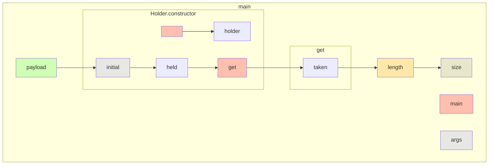

```mermaid
flowchart TD
  subgraph b0["main"]
    n1[main]:::RETURN
    n2[args]:::FUNC_PARAM
    n3[holder]:::OBJ_VARIABLE
    n4["payload"]:::LITERAL
    n9[taken]:::OBJ_VARIABLE
    n12[size]:::VARIABLE
    n13[length]:::EXTERNAL
    n4["payload"]:::LITERAL --> n7[initial]:::FUNC_PARAM
    n9[taken]:::OBJ_VARIABLE --> n13[length]:::EXTERNAL
    n13[length]:::EXTERNAL --> n12[size]:::VARIABLE
    subgraph b5["Holder.constructor"]
      n6[<init>]:::RETURN
      n7[initial]:::FUNC_PARAM
      n8[held]:::OBJ_VARIABLE
      n6[<init>]:::RETURN --> n3[holder]:::OBJ_VARIABLE
      n7[initial]:::FUNC_PARAM --> n8[held]:::OBJ_VARIABLE
      n8[held]:::OBJ_VARIABLE --> n11[get]:::RETURN
    end
    subgraph b10["get"]
      n11[get]:::RETURN
      n11[get]:::RETURN --> n9[taken]:::OBJ_VARIABLE
    end
  end
  classDef LITERAL fill:#00FF0030
  classDef VARIABLE fill:#80808030
  classDef BIN_OP fill:#80808080
  classDef FUNC_PARAM fill:#8080FF30
  classDef RETURN fill:#FF808080
  classDef EXTERNAL fill:#FFA50040
```
