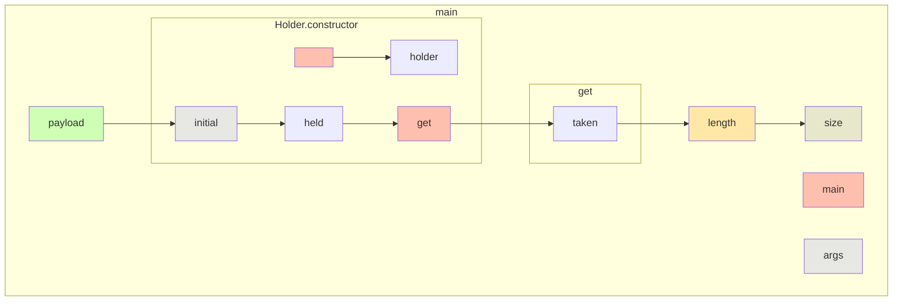

```mermaid
flowchart TD
  subgraph b0["main"]
    n1[main]:::RETURN
    n2[args]:::FUNC_PARAM
    n3["payload"]:::LITERAL
    n8[holder]:::OBJ_VARIABLE
    n11[taken]:::OBJ_VARIABLE
    n12[length]:::EXTERNAL
    n13[size]:::VARIABLE
    n3["payload"]:::LITERAL --> n6[initial]:::FUNC_PARAM
    n11[taken]:::OBJ_VARIABLE --> n12[length]:::EXTERNAL
    n12[length]:::EXTERNAL --> n13[size]:::VARIABLE
    subgraph b4["Holder.constructor"]
      n5[<init>]:::RETURN
      n6[initial]:::FUNC_PARAM
      n7[held]:::OBJ_VARIABLE
      n5[<init>]:::RETURN --> n8[holder]:::OBJ_VARIABLE
      n6[initial]:::FUNC_PARAM --> n7[held]:::OBJ_VARIABLE
      n7[held]:::OBJ_VARIABLE --> n10[get]:::RETURN
    end
    subgraph b9["get"]
      n10[get]:::RETURN
      n10[get]:::RETURN --> n11[taken]:::OBJ_VARIABLE
    end
  end
  classDef LITERAL fill:#00FF0030
  classDef VARIABLE fill:#80808030
  classDef BIN_OP fill:#80808080
  classDef FUNC_PARAM fill:#8080FF30
  classDef RETURN fill:#FF808080
  classDef EXTERNAL fill:#FFA50040
  classDef UNMODELLED fill:#FF000030,stroke-dasharray: 4 2
```
