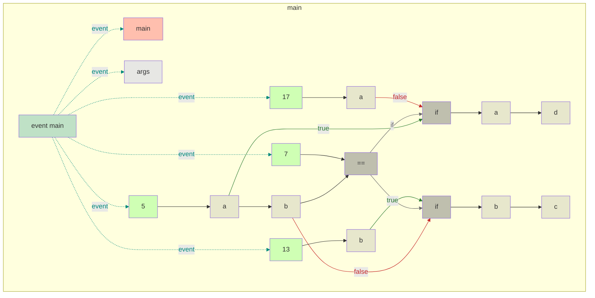

```mermaid
flowchart TD
  subgraph b0["main"]
    n1[event main]:::EVENT
    n2[main]:::RETURN
    n3[args]:::FUNC_PARAM
    n4[5]:::LITERAL
    n5[a]:::VARIABLE
    n6[b]:::VARIABLE
    n7[7]:::LITERAL
    n8[==]:::BIN_OP
    n9[13]:::LITERAL
    n10[b]:::VARIABLE
    n11[17]:::LITERAL
    n12[a]:::VARIABLE
    n13[if]:::BIN_OP
    n14[a]:::VARIABLE
    n15[if]:::BIN_OP
    n16[b]:::VARIABLE
    n17[c]:::VARIABLE
    n18[d]:::VARIABLE
    n1[event main]:::EVENT -. event .-> n2[main]:::RETURN
    n1[event main]:::EVENT -. event .-> n3[args]:::FUNC_PARAM
    n1[event main]:::EVENT -. event .-> n4[5]:::LITERAL
    n1[event main]:::EVENT -. event .-> n7[7]:::LITERAL
    n1[event main]:::EVENT -. event .-> n9[13]:::LITERAL
    n1[event main]:::EVENT -. event .-> n11[17]:::LITERAL
    n4[5]:::LITERAL --> n5[a]:::VARIABLE
    n5[a]:::VARIABLE --> n6[b]:::VARIABLE
    n5[a]:::VARIABLE -->|true| n13[if]:::BIN_OP
    n6[b]:::VARIABLE --> n8[==]:::BIN_OP
    n6[b]:::VARIABLE -->|false| n15[if]:::BIN_OP
    n7[7]:::LITERAL --> n8[==]:::BIN_OP
    n8[==]:::BIN_OP -->|if| n13[if]:::BIN_OP
    n8[==]:::BIN_OP -->|if| n15[if]:::BIN_OP
    n9[13]:::LITERAL --> n10[b]:::VARIABLE
    n10[b]:::VARIABLE -->|true| n15[if]:::BIN_OP
    n11[17]:::LITERAL --> n12[a]:::VARIABLE
    n12[a]:::VARIABLE -->|false| n13[if]:::BIN_OP
    n13[if]:::BIN_OP --> n14[a]:::VARIABLE
    n14[a]:::VARIABLE --> n18[d]:::VARIABLE
    n15[if]:::BIN_OP --> n16[b]:::VARIABLE
    n16[b]:::VARIABLE --> n17[c]:::VARIABLE
  end
  linkStyle 0 stroke:#00897b,color:#00897b
  linkStyle 1 stroke:#00897b,color:#00897b
  linkStyle 2 stroke:#00897b,color:#00897b
  linkStyle 3 stroke:#00897b,color:#00897b
  linkStyle 4 stroke:#00897b,color:#00897b
  linkStyle 5 stroke:#00897b,color:#00897b
  linkStyle 8 stroke:#2e7d32,color:#2e7d32
  linkStyle 10 stroke:#c62828,color:#c62828
  linkStyle 12 stroke:#6a6a6a,color:#6a6a6a
  linkStyle 13 stroke:#6a6a6a,color:#6a6a6a
  linkStyle 15 stroke:#2e7d32,color:#2e7d32
  linkStyle 17 stroke:#c62828,color:#c62828
  classDef LITERAL fill:#00FF0030
  classDef VARIABLE fill:#80808030
  classDef BIN_OP fill:#80808080
  classDef FUNC_PARAM fill:#8080FF30
  classDef RETURN fill:#FF808080
  classDef EXTERNAL fill:#FFA50040
  classDef UNMODELLED fill:#FF000030,stroke-dasharray: 4 2
  classDef EVENT fill:#00897B40
```
