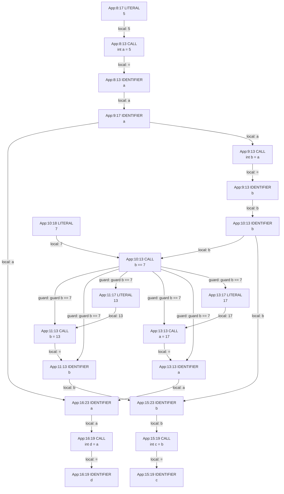

# if1: spike value graph

```mermaid
flowchart TD
  n0["App:10:13 CALL<br/>b == 7"]
  n1["App:10:13 IDENTIFIER<br/>b"]
  n2["App:10:18 LITERAL<br/>7"]
  n3["App:11:13 CALL<br/>b = 13"]
  n4["App:11:13 IDENTIFIER<br/>b"]
  n5["App:11:17 LITERAL<br/>13"]
  n6["App:13:13 CALL<br/>a = 17"]
  n7["App:13:13 IDENTIFIER<br/>a"]
  n8["App:13:17 LITERAL<br/>17"]
  n9["App:15:19 CALL<br/>int c = b"]
  n10["App:15:19 IDENTIFIER<br/>c"]
  n11["App:15:23 IDENTIFIER<br/>b"]
  n12["App:16:19 CALL<br/>int d = a"]
  n13["App:16:19 IDENTIFIER<br/>d"]
  n14["App:16:23 IDENTIFIER<br/>a"]
  n15["App:8:13 CALL<br/>int a = 5"]
  n16["App:8:13 IDENTIFIER<br/>a"]
  n17["App:8:17 LITERAL<br/>5"]
  n18["App:9:13 CALL<br/>int b = a"]
  n19["App:9:13 IDENTIFIER<br/>b"]
  n20["App:9:17 IDENTIFIER<br/>a"]
  n0 -->|"guard: guard b == 7"| n3
  n0 -->|"guard: guard b == 7"| n4
  n0 -->|"guard: guard b == 7"| n5
  n0 -->|"guard: guard b == 7"| n6
  n0 -->|"guard: guard b == 7"| n7
  n0 -->|"guard: guard b == 7"| n8
  n1 -->|"local: b"| n0
  n1 -->|"local: b"| n11
  n11 -->|"local: b"| n9
  n12 -->|"local: ="| n13
  n14 -->|"local: a"| n12
  n15 -->|"local: ="| n16
  n16 -->|"local: a"| n20
  n17 -->|"local: 5"| n15
  n18 -->|"local: ="| n19
  n19 -->|"local: b"| n1
  n2 -->|"local: 7"| n0
  n20 -->|"local: a"| n14
  n20 -->|"local: a"| n18
  n3 -->|"local: ="| n4
  n4 -->|"local: b"| n11
  n5 -->|"local: 13"| n3
  n6 -->|"local: ="| n7
  n7 -->|"local: a"| n14
  n8 -->|"local: 17"| n6
  n9 -->|"local: ="| n10
```
