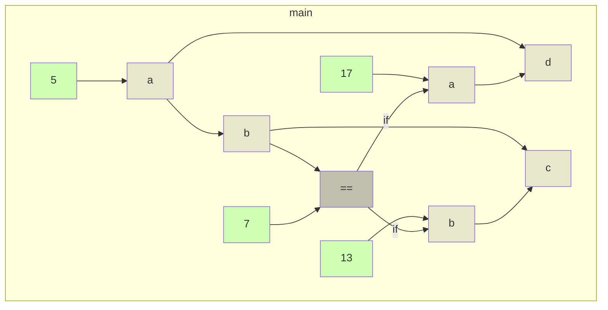

# if1: spike value graph (condensed)

```mermaid
flowchart TD
  subgraph m0["main"]
    n0["=="]:::BIN_OP
    n1["13"]:::LITERAL
    n2["17"]:::LITERAL
    n3["5"]:::LITERAL
    n4["7"]:::LITERAL
    n5["a"]:::VARIABLE
    n6["a"]:::VARIABLE
    n7["b"]:::VARIABLE
    n8["b"]:::VARIABLE
    n9["c"]:::VARIABLE
    n10["d"]:::VARIABLE
  end
  n0 -->|if| n5
  n0 -->|if| n7
  n1 --> n7
  n2 --> n5
  n3 --> n6
  n4 --> n0
  n5 --> n10
  n6 --> n10
  n6 --> n8
  n7 --> n9
  n8 --> n0
  n8 --> n9
  classDef LITERAL fill:#00FF0030
  classDef VARIABLE fill:#80808030
  classDef BIN_OP fill:#80808080
  classDef FUNC_PARAM fill:#8080FF30
  classDef RETURN fill:#FF808080
  classDef EXTERNAL fill:#FFA50040
  classDef UNMODELLED fill:#FF000030,stroke-dasharray: 4 2
```
