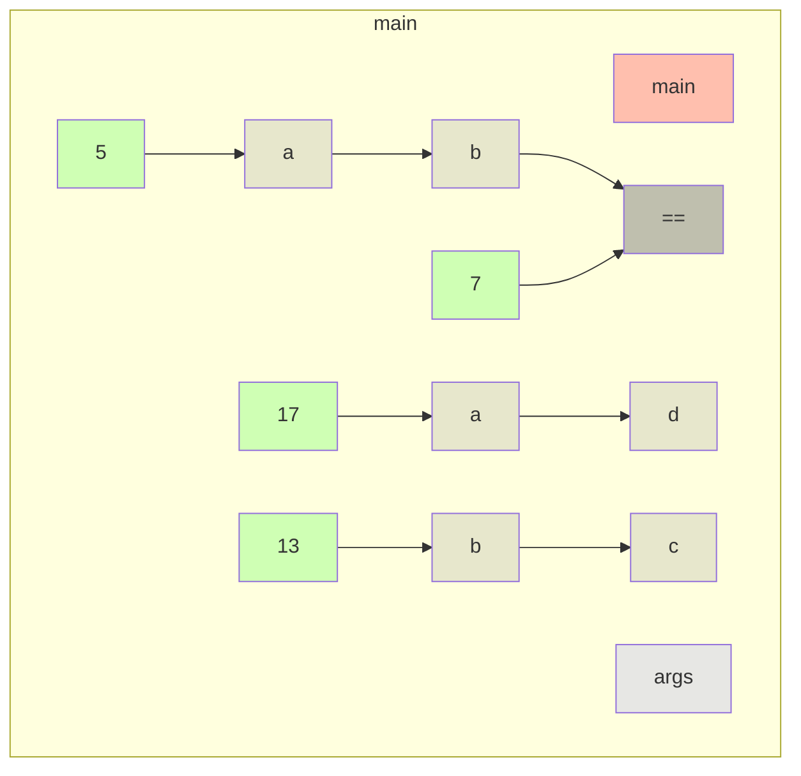

```mermaid
flowchart TD
  subgraph 4309014["main"]
    -777998350[5]:::LITERAL
    -777997610[a]:::VARIABLE
    -777997553[b]:::VARIABLE
    -777997542[7]:::LITERAL
    -777996546[c]:::VARIABLE
    -777995790[d]:::VARIABLE
    -777971724[13]:::LITERAL
    -777971535[17]:::LITERAL
    -777965298[==]:::BIN_OP
    -727013490[args]:::FUNC_PARAM
    12485[a]:::VARIABLE
    12502[b]:::VARIABLE
    56853577[main]:::RETURN
    -777998350[5]:::LITERAL --> -777997610[a]:::VARIABLE
    -777997610[a]:::VARIABLE --> -777997553[b]:::VARIABLE
    -777997553[b]:::VARIABLE --> -777965298[==]:::BIN_OP
    -777997542[7]:::LITERAL --> -777965298[==]:::BIN_OP
    -777971724[13]:::LITERAL --> 12502[b]:::VARIABLE
    -777971535[17]:::LITERAL --> 12485[a]:::VARIABLE
    12485[a]:::VARIABLE --> -777995790[d]:::VARIABLE
    12502[b]:::VARIABLE --> -777996546[c]:::VARIABLE
  end
  classDef LITERAL fill:#00FF0030
  classDef VARIABLE fill:#80808030
  classDef BIN_OP fill:#80808080
  classDef FUNC_PARAM fill:#8080FF30
  classDef RETURN fill:#FF808080
```
