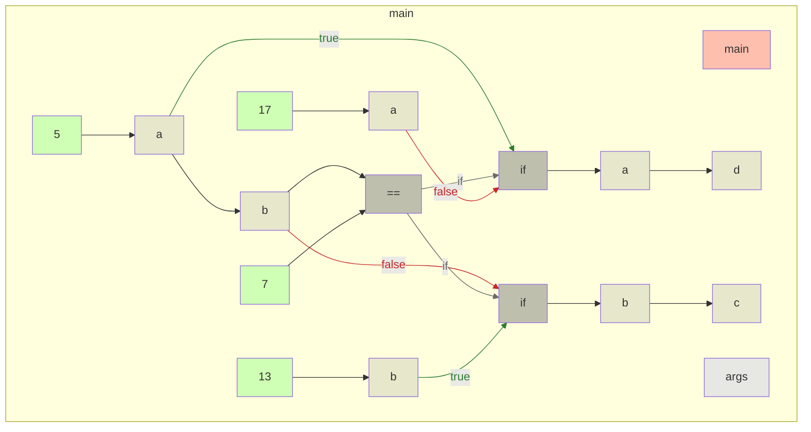

```mermaid
flowchart TD
  subgraph b0["main"]
    n1[main]:::RETURN
    n2[args]:::FUNC_PARAM
    n3[5]:::LITERAL
    n4[a]:::VARIABLE
    n5[b]:::VARIABLE
    n6[7]:::LITERAL
    n7[==]:::BIN_OP
    n8[13]:::LITERAL
    n9[b]:::VARIABLE
    n10[17]:::LITERAL
    n11[a]:::VARIABLE
    n12[if]:::BIN_OP
    n13[a]:::VARIABLE
    n14[if]:::BIN_OP
    n15[b]:::VARIABLE
    n16[c]:::VARIABLE
    n17[d]:::VARIABLE
    n3[5]:::LITERAL --> n4[a]:::VARIABLE
    n4[a]:::VARIABLE --> n5[b]:::VARIABLE
    n4[a]:::VARIABLE -->|true| n12[if]:::BIN_OP
    n5[b]:::VARIABLE --> n7[==]:::BIN_OP
    n5[b]:::VARIABLE -->|false| n14[if]:::BIN_OP
    n6[7]:::LITERAL --> n7[==]:::BIN_OP
    n7[==]:::BIN_OP -->|if| n12[if]:::BIN_OP
    n7[==]:::BIN_OP -->|if| n14[if]:::BIN_OP
    n8[13]:::LITERAL --> n9[b]:::VARIABLE
    n9[b]:::VARIABLE -->|true| n14[if]:::BIN_OP
    n10[17]:::LITERAL --> n11[a]:::VARIABLE
    n11[a]:::VARIABLE -->|false| n12[if]:::BIN_OP
    n12[if]:::BIN_OP --> n13[a]:::VARIABLE
    n13[a]:::VARIABLE --> n17[d]:::VARIABLE
    n14[if]:::BIN_OP --> n15[b]:::VARIABLE
    n15[b]:::VARIABLE --> n16[c]:::VARIABLE
  end
  linkStyle 2 stroke:#2e7d32,color:#2e7d32
  linkStyle 4 stroke:#c62828,color:#c62828
  linkStyle 6 stroke:#6a6a6a,color:#6a6a6a
  linkStyle 7 stroke:#6a6a6a,color:#6a6a6a
  linkStyle 9 stroke:#2e7d32,color:#2e7d32
  linkStyle 11 stroke:#c62828,color:#c62828
  classDef LITERAL fill:#00FF0030
  classDef VARIABLE fill:#80808030
  classDef BIN_OP fill:#80808080
  classDef FUNC_PARAM fill:#8080FF30
  classDef RETURN fill:#FF808080
  classDef EXTERNAL fill:#FFA50040
  classDef UNMODELLED fill:#FF000030,stroke-dasharray: 4 2
```
