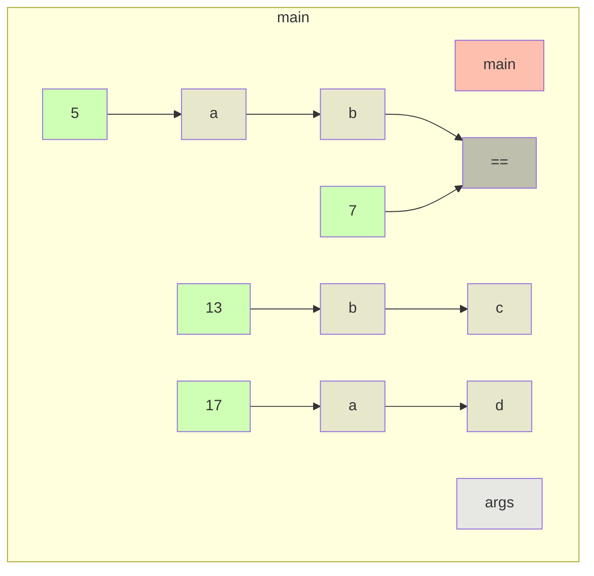

```mermaid
flowchart TD
  subgraph b0["main"]
    n1[main]:::RETURN
    n2[args]:::FUNC_PARAM
    n3[a]:::VARIABLE
    n4[5]:::LITERAL
    n5[b]:::VARIABLE
    n6[7]:::LITERAL
    n7[==]:::BIN_OP
    n8[b]:::VARIABLE
    n9[13]:::LITERAL
    n10[a]:::VARIABLE
    n11[17]:::LITERAL
    n12[c]:::VARIABLE
    n13[d]:::VARIABLE
    n3[a]:::VARIABLE --> n5[b]:::VARIABLE
    n4[5]:::LITERAL --> n3[a]:::VARIABLE
    n5[b]:::VARIABLE --> n7[==]:::BIN_OP
    n6[7]:::LITERAL --> n7[==]:::BIN_OP
    n8[b]:::VARIABLE --> n12[c]:::VARIABLE
    n9[13]:::LITERAL --> n8[b]:::VARIABLE
    n10[a]:::VARIABLE --> n13[d]:::VARIABLE
    n11[17]:::LITERAL --> n10[a]:::VARIABLE
  end
  classDef LITERAL fill:#00FF0030
  classDef VARIABLE fill:#80808030
  classDef BIN_OP fill:#80808080
  classDef FUNC_PARAM fill:#8080FF30
  classDef RETURN fill:#FF808080
  classDef EXTERNAL fill:#FFA50040
```
