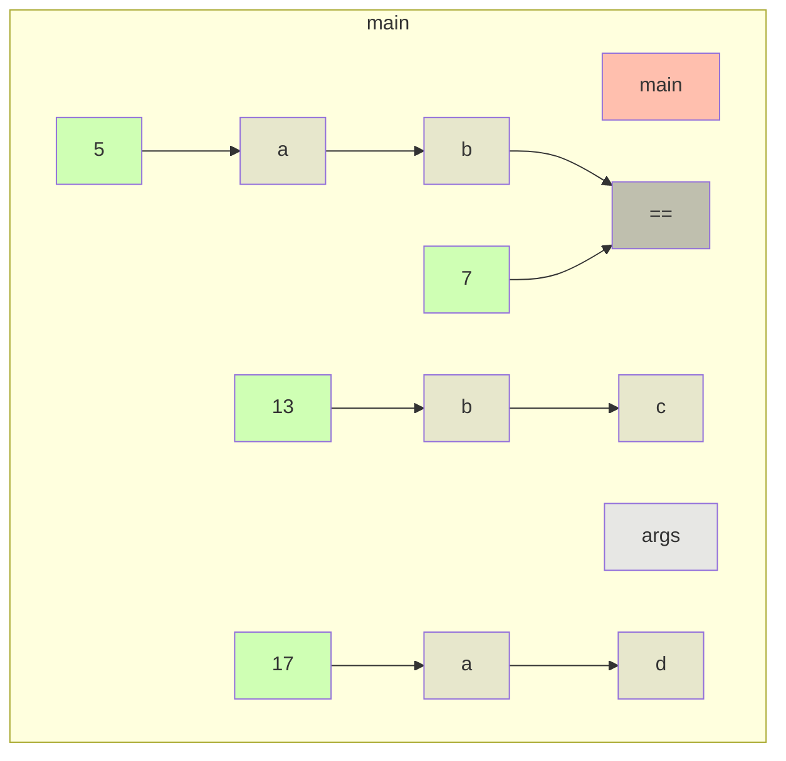

```mermaid
flowchart TD
  subgraph 4309014["main"]
    -397614065[d]:::VARIABLE
    12485[a]:::VARIABLE
    12502[b]:::VARIABLE
    56853577[main]:::RETURN
    1649928516[a]:::VARIABLE
    1649929821[5]:::LITERAL
    1649934307[b]:::VARIABLE
    1649962372[7]:::LITERAL
    1649992849[==]:::BIN_OP
    1650014294[13]:::LITERAL
    1650046038[17]:::LITERAL
    1650048582[c]:::VARIABLE
    1700884858[args]:::FUNC_PARAM
    12485[a]:::VARIABLE --> -397614065[d]:::VARIABLE
    12502[b]:::VARIABLE --> 1650048582[c]:::VARIABLE
    1649928516[a]:::VARIABLE --> 1649934307[b]:::VARIABLE
    1649929821[5]:::LITERAL --> 1649928516[a]:::VARIABLE
    1649934307[b]:::VARIABLE --> 1649992849[==]:::BIN_OP
    1649962372[7]:::LITERAL --> 1649992849[==]:::BIN_OP
    1650014294[13]:::LITERAL --> 12502[b]:::VARIABLE
    1650046038[17]:::LITERAL --> 12485[a]:::VARIABLE
  end
  classDef LITERAL fill:#00FF0030
  classDef VARIABLE fill:#80808030
  classDef BIN_OP fill:#80808080
  classDef FUNC_PARAM fill:#8080FF30
  classDef RETURN fill:#FF808080
```
