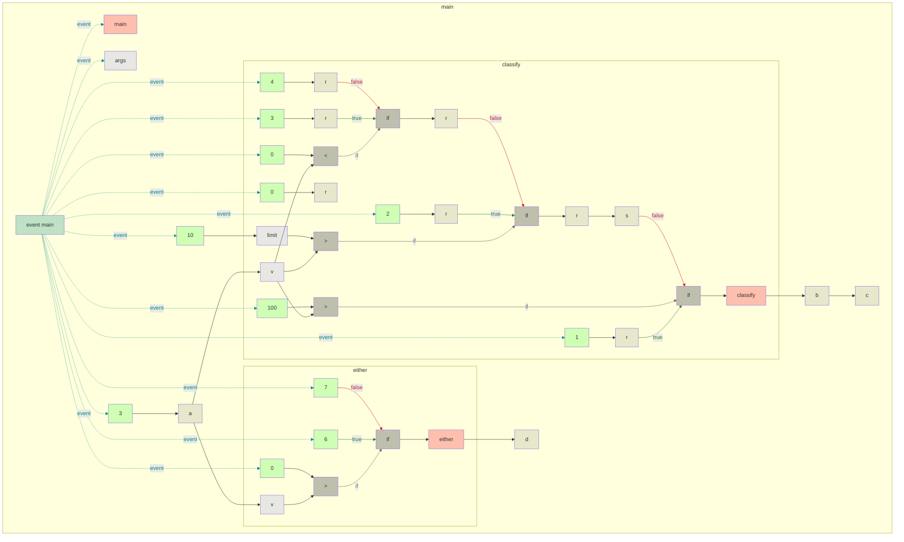

```mermaid
flowchart TD
  subgraph b0["main"]
    n1[event main]:::EVENT
    n2[main]:::RETURN
    n3[args]:::FUNC_PARAM
    n4[3]:::LITERAL
    n5[a]:::VARIABLE
    n6[10]:::LITERAL
    n32[b]:::VARIABLE
    n33[c]:::VARIABLE
    n42[d]:::VARIABLE
    n1[event main]:::EVENT -. event .-> n2[main]:::RETURN
    n1[event main]:::EVENT -. event .-> n3[args]:::FUNC_PARAM
    n1[event main]:::EVENT -. event .-> n4[3]:::LITERAL
    n1[event main]:::EVENT -. event .-> n6[10]:::LITERAL
    n1[event main]:::EVENT -. event .-> n11[0]:::LITERAL
    n1[event main]:::EVENT -. event .-> n14[1]:::LITERAL
    n1[event main]:::EVENT -. event .-> n16[100]:::LITERAL
    n1[event main]:::EVENT -. event .-> n18[2]:::LITERAL
    n1[event main]:::EVENT -. event .-> n20[0]:::LITERAL
    n1[event main]:::EVENT -. event .-> n22[3]:::LITERAL
    n1[event main]:::EVENT -. event .-> n24[4]:::LITERAL
    n1[event main]:::EVENT -. event .-> n37[0]:::LITERAL
    n1[event main]:::EVENT -. event .-> n39[6]:::LITERAL
    n1[event main]:::EVENT -. event .-> n40[7]:::LITERAL
    n4[3]:::LITERAL --> n5[a]:::VARIABLE
    n5[a]:::VARIABLE --> n9[v]:::FUNC_PARAM
    n5[a]:::VARIABLE --> n36[v]:::FUNC_PARAM
    n6[10]:::LITERAL --> n10[limit]:::FUNC_PARAM
    n32[b]:::VARIABLE --> n33[c]:::VARIABLE
    n8[classify]:::RETURN --> n32[b]:::VARIABLE
    n35[either]:::RETURN --> n42[d]:::VARIABLE
    subgraph b7["classify"]
      n8[classify]:::RETURN
      n9[v]:::FUNC_PARAM
      n10[limit]:::FUNC_PARAM
      n11[0]:::LITERAL
      n12[r]:::VARIABLE
      n13[>]:::BIN_OP
      n14[1]:::LITERAL
      n15[r]:::VARIABLE
      n16[100]:::LITERAL
      n17[>]:::BIN_OP
      n18[2]:::LITERAL
      n19[r]:::VARIABLE
      n20[0]:::LITERAL
      n21[<]:::BIN_OP
      n22[3]:::LITERAL
      n23[r]:::VARIABLE
      n24[4]:::LITERAL
      n25[r]:::VARIABLE
      n26[if]:::BIN_OP
      n27[r]:::VARIABLE
      n28[if]:::BIN_OP
      n29[r]:::VARIABLE
      n30[s]:::VARIABLE
      n31[if]:::BIN_OP
      n9[v]:::FUNC_PARAM --> n13[>]:::BIN_OP
      n9[v]:::FUNC_PARAM --> n17[>]:::BIN_OP
      n9[v]:::FUNC_PARAM --> n21[<]:::BIN_OP
      n10[limit]:::FUNC_PARAM --> n13[>]:::BIN_OP
      n11[0]:::LITERAL --> n12[r]:::VARIABLE
      n13[>]:::BIN_OP -->|if| n28[if]:::BIN_OP
      n14[1]:::LITERAL --> n15[r]:::VARIABLE
      n15[r]:::VARIABLE -->|true| n31[if]:::BIN_OP
      n16[100]:::LITERAL --> n17[>]:::BIN_OP
      n17[>]:::BIN_OP -->|if| n31[if]:::BIN_OP
      n18[2]:::LITERAL --> n19[r]:::VARIABLE
      n19[r]:::VARIABLE -->|true| n28[if]:::BIN_OP
      n20[0]:::LITERAL --> n21[<]:::BIN_OP
      n21[<]:::BIN_OP -->|if| n26[if]:::BIN_OP
      n22[3]:::LITERAL --> n23[r]:::VARIABLE
      n23[r]:::VARIABLE -->|true| n26[if]:::BIN_OP
      n24[4]:::LITERAL --> n25[r]:::VARIABLE
      n25[r]:::VARIABLE -->|false| n26[if]:::BIN_OP
      n26[if]:::BIN_OP --> n27[r]:::VARIABLE
      n27[r]:::VARIABLE -->|false| n28[if]:::BIN_OP
      n28[if]:::BIN_OP --> n29[r]:::VARIABLE
      n29[r]:::VARIABLE --> n30[s]:::VARIABLE
      n30[s]:::VARIABLE -->|false| n31[if]:::BIN_OP
      n31[if]:::BIN_OP --> n8[classify]:::RETURN
    end
    subgraph b34["either"]
      n35[either]:::RETURN
      n36[v]:::FUNC_PARAM
      n37[0]:::LITERAL
      n38[>]:::BIN_OP
      n39[6]:::LITERAL
      n40[7]:::LITERAL
      n41[if]:::BIN_OP
      n36[v]:::FUNC_PARAM --> n38[>]:::BIN_OP
      n37[0]:::LITERAL --> n38[>]:::BIN_OP
      n38[>]:::BIN_OP -->|if| n41[if]:::BIN_OP
      n39[6]:::LITERAL -->|true| n41[if]:::BIN_OP
      n40[7]:::LITERAL -->|false| n41[if]:::BIN_OP
      n41[if]:::BIN_OP --> n35[either]:::RETURN
    end
  end
  linkStyle 0 stroke:#00897b,color:#00897b
  linkStyle 1 stroke:#00897b,color:#00897b
  linkStyle 2 stroke:#00897b,color:#00897b
  linkStyle 3 stroke:#00897b,color:#00897b
  linkStyle 4 stroke:#00897b,color:#00897b
  linkStyle 5 stroke:#00897b,color:#00897b
  linkStyle 6 stroke:#00897b,color:#00897b
  linkStyle 7 stroke:#00897b,color:#00897b
  linkStyle 8 stroke:#00897b,color:#00897b
  linkStyle 9 stroke:#00897b,color:#00897b
  linkStyle 10 stroke:#00897b,color:#00897b
  linkStyle 11 stroke:#00897b,color:#00897b
  linkStyle 12 stroke:#00897b,color:#00897b
  linkStyle 13 stroke:#00897b,color:#00897b
  linkStyle 26 stroke:#6a6a6a,color:#6a6a6a
  linkStyle 28 stroke:#2e7d32,color:#2e7d32
  linkStyle 30 stroke:#6a6a6a,color:#6a6a6a
  linkStyle 32 stroke:#2e7d32,color:#2e7d32
  linkStyle 34 stroke:#6a6a6a,color:#6a6a6a
  linkStyle 36 stroke:#2e7d32,color:#2e7d32
  linkStyle 38 stroke:#c62828,color:#c62828
  linkStyle 40 stroke:#c62828,color:#c62828
  linkStyle 43 stroke:#c62828,color:#c62828
  linkStyle 47 stroke:#6a6a6a,color:#6a6a6a
  linkStyle 48 stroke:#2e7d32,color:#2e7d32
  linkStyle 49 stroke:#c62828,color:#c62828
  classDef LITERAL fill:#00FF0030
  classDef VARIABLE fill:#80808030
  classDef BIN_OP fill:#80808080
  classDef FUNC_PARAM fill:#8080FF30
  classDef RETURN fill:#FF808080
  classDef EXTERNAL fill:#FFA50040
  classDef UNMODELLED fill:#FF000030,stroke-dasharray: 4 2
  classDef EVENT fill:#00897B40
```
