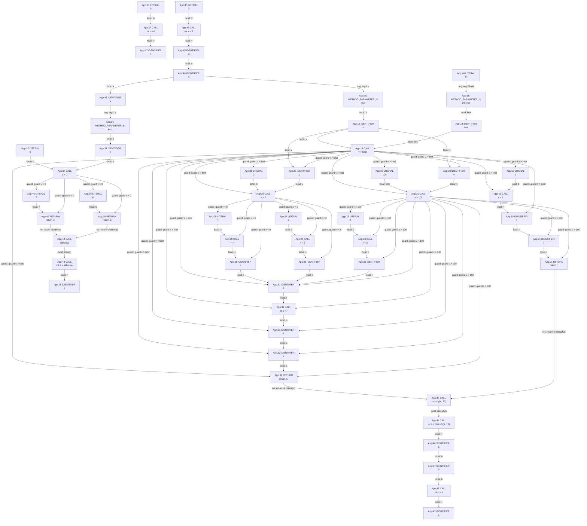

# if2: spike value graph

```mermaid
flowchart TD
  n0["App:16 METHOD_PARAMETER_IN<br/>int limit"]
  n1["App:16 METHOD_PARAMETER_IN<br/>int v"]
  n2["App:17 CALL<br/>int r = 0"]
  n3["App:17 IDENTIFIER<br/>r"]
  n4["App:17 LITERAL<br/>0"]
  n5["App:18 CALL<br/>v #gt; limit"]
  n6["App:18 IDENTIFIER<br/>limit"]
  n7["App:18 IDENTIFIER<br/>v"]
  n8["App:19 CALL<br/>r = 1"]
  n9["App:19 IDENTIFIER<br/>r"]
  n10["App:19 LITERAL<br/>1"]
  n11["App:20 CALL<br/>v #gt; 100"]
  n12["App:20 IDENTIFIER<br/>v"]
  n13["App:20 LITERAL<br/>100"]
  n14["App:21 IDENTIFIER<br/>r"]
  n15["App:21 RETURN<br/>return r;"]
  n16["App:23 CALL<br/>r = 2"]
  n17["App:23 IDENTIFIER<br/>r"]
  n18["App:23 LITERAL<br/>2"]
  n19["App:25 CALL<br/>v #lt; 0"]
  n20["App:25 IDENTIFIER<br/>v"]
  n21["App:25 LITERAL<br/>0"]
  n22["App:26 CALL<br/>r = 3"]
  n23["App:26 IDENTIFIER<br/>r"]
  n24["App:26 LITERAL<br/>3"]
  n25["App:28 CALL<br/>r = 4"]
  n26["App:28 IDENTIFIER<br/>r"]
  n27["App:28 LITERAL<br/>4"]
  n28["App:31 CALL<br/>int s = r"]
  n29["App:31 IDENTIFIER<br/>r"]
  n30["App:31 IDENTIFIER<br/>s"]
  n31["App:32 IDENTIFIER<br/>s"]
  n32["App:32 RETURN<br/>return s;"]
  n33["App:36 METHOD_PARAMETER_IN<br/>int v"]
  n34["App:37 CALL<br/>v #gt; 0"]
  n35["App:37 IDENTIFIER<br/>v"]
  n36["App:37 LITERAL<br/>0"]
  n37["App:38 LITERAL<br/>6"]
  n38["App:38 RETURN<br/>return 6;"]
  n39["App:40 LITERAL<br/>7"]
  n40["App:40 RETURN<br/>return 7;"]
  n41["App:45 CALL<br/>int a = 3"]
  n42["App:45 IDENTIFIER<br/>a"]
  n43["App:45 LITERAL<br/>3"]
  n44["App:46 CALL<br/>classify(a, 10)"]
  n45["App:46 CALL<br/>int b = classify(a, 10)"]
  n46["App:46 IDENTIFIER<br/>a"]
  n47["App:46 IDENTIFIER<br/>b"]
  n48["App:46 LITERAL<br/>10"]
  n49["App:47 CALL<br/>int c = b"]
  n50["App:47 IDENTIFIER<br/>b"]
  n51["App:47 IDENTIFIER<br/>c"]
  n52["App:48 CALL<br/>either(a)"]
  n53["App:48 CALL<br/>int d = either(a)"]
  n54["App:48 IDENTIFIER<br/>a"]
  n55["App:48 IDENTIFIER<br/>d"]
  n0 -->|"local: limit"| n6
  n1 -->|"local: v"| n7
  n10 -->|"local: 1"| n8
  n11 -->|"guard: guard v #gt; 100"| n14
  n11 -->|"guard: guard v #gt; 100"| n15
  n11 -->|"guard: guard v #gt; 100"| n16
  n11 -->|"guard: guard v #gt; 100"| n17
  n11 -->|"guard: guard v #gt; 100"| n18
  n11 -->|"guard: guard v #gt; 100"| n28
  n11 -->|"guard: guard v #gt; 100"| n29
  n11 -->|"guard: guard v #gt; 100"| n30
  n11 -->|"guard: guard v #gt; 100"| n31
  n11 -->|"guard: guard v #gt; 100"| n32
  n12 -->|"local: v"| n11
  n13 -->|"local: 100"| n11
  n14 -->|"local: r"| n15
  n15 -->|"ret: return of classify()"| n44
  n16 -->|"local: ="| n17
  n17 -->|"local: r"| n29
  n18 -->|"local: 2"| n16
  n19 -->|"guard: guard v #lt; 0"| n22
  n19 -->|"guard: guard v #lt; 0"| n23
  n19 -->|"guard: guard v #lt; 0"| n24
  n19 -->|"guard: guard v #lt; 0"| n25
  n19 -->|"guard: guard v #lt; 0"| n26
  n19 -->|"guard: guard v #lt; 0"| n27
  n2 -->|"local: ="| n3
  n20 -->|"local: v"| n19
  n21 -->|"local: 0"| n19
  n22 -->|"local: ="| n23
  n23 -->|"local: r"| n29
  n24 -->|"local: 3"| n22
  n25 -->|"local: ="| n26
  n26 -->|"local: r"| n29
  n27 -->|"local: 4"| n25
  n28 -->|"local: ="| n30
  n29 -->|"local: r"| n28
  n30 -->|"local: s"| n31
  n31 -->|"local: s"| n32
  n32 -->|"ret: return of classify()"| n44
  n33 -->|"local: v"| n35
  n34 -->|"guard: guard v #gt; 0"| n37
  n34 -->|"guard: guard v #gt; 0"| n38
  n34 -->|"guard: guard v #gt; 0"| n39
  n34 -->|"guard: guard v #gt; 0"| n40
  n35 -->|"local: v"| n34
  n36 -->|"local: 0"| n34
  n37 -->|"local: 6"| n38
  n38 -->|"ret: return of either()"| n52
  n39 -->|"local: 7"| n40
  n4 -->|"local: 0"| n2
  n40 -->|"ret: return of either()"| n52
  n41 -->|"local: ="| n42
  n42 -->|"local: a"| n46
  n43 -->|"local: 3"| n41
  n44 -->|"local: classify()"| n45
  n45 -->|"local: ="| n47
  n46 -->|"arg: arg 1 v"| n1
  n46 -->|"local: a"| n54
  n47 -->|"local: b"| n50
  n48 -->|"arg: arg 2 limit"| n0
  n49 -->|"local: ="| n51
  n5 -->|"guard: guard v #gt; limit"| n10
  n5 -->|"guard: guard v #gt; limit"| n11
  n5 -->|"guard: guard v #gt; limit"| n12
  n5 -->|"guard: guard v #gt; limit"| n13
  n5 -->|"guard: guard v #gt; limit"| n19
  n5 -->|"guard: guard v #gt; limit"| n20
  n5 -->|"guard: guard v #gt; limit"| n21
  n5 -->|"guard: guard v #gt; limit"| n28
  n5 -->|"guard: guard v #gt; limit"| n29
  n5 -->|"guard: guard v #gt; limit"| n30
  n5 -->|"guard: guard v #gt; limit"| n31
  n5 -->|"guard: guard v #gt; limit"| n32
  n5 -->|"guard: guard v #gt; limit"| n8
  n5 -->|"guard: guard v #gt; limit"| n9
  n50 -->|"local: b"| n49
  n52 -->|"local: either()"| n53
  n53 -->|"local: ="| n55
  n54 -->|"arg: arg 1 v"| n33
  n6 -->|"local: limit"| n5
  n7 -->|"local: v"| n12
  n7 -->|"local: v"| n20
  n7 -->|"local: v"| n5
  n8 -->|"local: ="| n9
  n9 -->|"local: r"| n14
```
