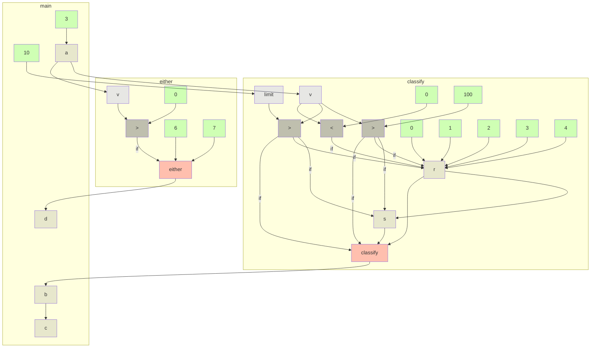

# if2: spike value graph (condensed)

```mermaid
flowchart TD
  subgraph m0["classify"]
    n0["#lt;"]:::BIN_OP
    n1["#gt;"]:::BIN_OP
    n2["#gt;"]:::BIN_OP
    n3["limit"]:::FUNC_PARAM
    n4["v"]:::FUNC_PARAM
    n5["0"]:::LITERAL
    n6["0"]:::LITERAL
    n7["100"]:::LITERAL
    n8["1"]:::LITERAL
    n9["2"]:::LITERAL
    n10["3"]:::LITERAL
    n11["4"]:::LITERAL
    n12["classify"]:::RETURN
    n13["r"]:::VARIABLE
    n14["s"]:::VARIABLE
  end
  subgraph m1["either"]
    n15["#gt;"]:::BIN_OP
    n16["v"]:::FUNC_PARAM
    n17["0"]:::LITERAL
    n18["6"]:::LITERAL
    n19["7"]:::LITERAL
    n20["either"]:::RETURN
  end
  subgraph m2["main"]
    n21["10"]:::LITERAL
    n22["3"]:::LITERAL
    n23["a"]:::VARIABLE
    n24["b"]:::VARIABLE
    n25["c"]:::VARIABLE
    n26["d"]:::VARIABLE
  end
  n0 -->|if| n13
  n1 -->|if| n12
  n1 -->|if| n13
  n1 -->|if| n14
  n10 --> n13
  n11 --> n13
  n12 --> n24
  n13 --> n12
  n13 --> n14
  n14 --> n12
  n15 -->|if| n20
  n16 --> n15
  n17 --> n15
  n18 --> n20
  n19 --> n20
  n2 -->|if| n12
  n2 -->|if| n13
  n2 -->|if| n14
  n20 --> n26
  n21 --> n3
  n22 --> n23
  n23 --> n16
  n23 --> n4
  n24 --> n25
  n3 --> n1
  n4 --> n0
  n4 --> n1
  n4 --> n2
  n5 --> n13
  n6 --> n0
  n7 --> n2
  n8 --> n13
  n9 --> n13
  classDef LITERAL fill:#00FF0030
  classDef VARIABLE fill:#80808030
  classDef BIN_OP fill:#80808080
  classDef FUNC_PARAM fill:#8080FF30
  classDef RETURN fill:#FF808080
  classDef EXTERNAL fill:#FFA50040
  classDef UNMODELLED fill:#FF000030,stroke-dasharray: 4 2
```
