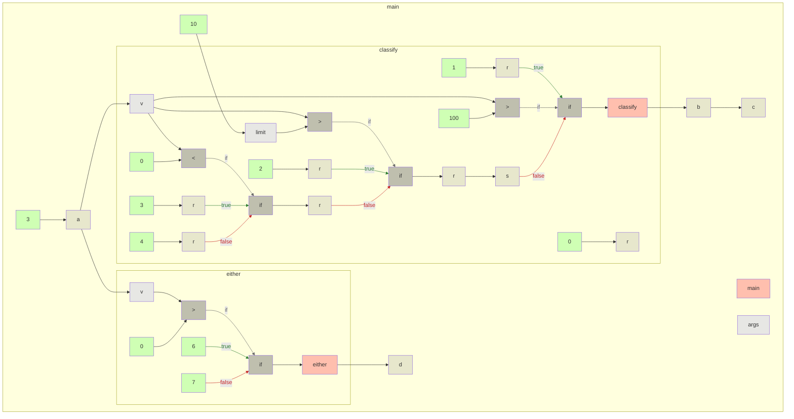

```mermaid
flowchart TD
  subgraph b0["main"]
    n1[main]:::RETURN
    n2[args]:::FUNC_PARAM
    n3[3]:::LITERAL
    n4[a]:::VARIABLE
    n5[10]:::LITERAL
    n31[b]:::VARIABLE
    n32[c]:::VARIABLE
    n41[d]:::VARIABLE
    n3[3]:::LITERAL --> n4[a]:::VARIABLE
    n4[a]:::VARIABLE --> n8[v]:::FUNC_PARAM
    n4[a]:::VARIABLE --> n35[v]:::FUNC_PARAM
    n5[10]:::LITERAL --> n9[limit]:::FUNC_PARAM
    n31[b]:::VARIABLE --> n32[c]:::VARIABLE
    n7[classify]:::RETURN --> n31[b]:::VARIABLE
    n34[either]:::RETURN --> n41[d]:::VARIABLE
    subgraph b6["classify"]
      n7[classify]:::RETURN
      n8[v]:::FUNC_PARAM
      n9[limit]:::FUNC_PARAM
      n10[0]:::LITERAL
      n11[r]:::VARIABLE
      n12[>]:::BIN_OP
      n13[1]:::LITERAL
      n14[r]:::VARIABLE
      n15[100]:::LITERAL
      n16[>]:::BIN_OP
      n17[2]:::LITERAL
      n18[r]:::VARIABLE
      n19[0]:::LITERAL
      n20[<]:::BIN_OP
      n21[3]:::LITERAL
      n22[r]:::VARIABLE
      n23[4]:::LITERAL
      n24[r]:::VARIABLE
      n25[if]:::BIN_OP
      n26[r]:::VARIABLE
      n27[if]:::BIN_OP
      n28[r]:::VARIABLE
      n29[s]:::VARIABLE
      n30[if]:::BIN_OP
      n8[v]:::FUNC_PARAM --> n12[>]:::BIN_OP
      n8[v]:::FUNC_PARAM --> n16[>]:::BIN_OP
      n8[v]:::FUNC_PARAM --> n20[<]:::BIN_OP
      n9[limit]:::FUNC_PARAM --> n12[>]:::BIN_OP
      n10[0]:::LITERAL --> n11[r]:::VARIABLE
      n12[>]:::BIN_OP -->|if| n27[if]:::BIN_OP
      n13[1]:::LITERAL --> n14[r]:::VARIABLE
      n14[r]:::VARIABLE -->|true| n30[if]:::BIN_OP
      n15[100]:::LITERAL --> n16[>]:::BIN_OP
      n16[>]:::BIN_OP -->|if| n30[if]:::BIN_OP
      n17[2]:::LITERAL --> n18[r]:::VARIABLE
      n18[r]:::VARIABLE -->|true| n27[if]:::BIN_OP
      n19[0]:::LITERAL --> n20[<]:::BIN_OP
      n20[<]:::BIN_OP -->|if| n25[if]:::BIN_OP
      n21[3]:::LITERAL --> n22[r]:::VARIABLE
      n22[r]:::VARIABLE -->|true| n25[if]:::BIN_OP
      n23[4]:::LITERAL --> n24[r]:::VARIABLE
      n24[r]:::VARIABLE -->|false| n25[if]:::BIN_OP
      n25[if]:::BIN_OP --> n26[r]:::VARIABLE
      n26[r]:::VARIABLE -->|false| n27[if]:::BIN_OP
      n27[if]:::BIN_OP --> n28[r]:::VARIABLE
      n28[r]:::VARIABLE --> n29[s]:::VARIABLE
      n29[s]:::VARIABLE -->|false| n30[if]:::BIN_OP
      n30[if]:::BIN_OP --> n7[classify]:::RETURN
    end
    subgraph b33["either"]
      n34[either]:::RETURN
      n35[v]:::FUNC_PARAM
      n36[0]:::LITERAL
      n37[>]:::BIN_OP
      n38[6]:::LITERAL
      n39[7]:::LITERAL
      n40[if]:::BIN_OP
      n35[v]:::FUNC_PARAM --> n37[>]:::BIN_OP
      n36[0]:::LITERAL --> n37[>]:::BIN_OP
      n37[>]:::BIN_OP -->|if| n40[if]:::BIN_OP
      n38[6]:::LITERAL -->|true| n40[if]:::BIN_OP
      n39[7]:::LITERAL -->|false| n40[if]:::BIN_OP
      n40[if]:::BIN_OP --> n34[either]:::RETURN
    end
  end
  linkStyle 12 stroke:#6a6a6a,color:#6a6a6a
  linkStyle 14 stroke:#2e7d32,color:#2e7d32
  linkStyle 16 stroke:#6a6a6a,color:#6a6a6a
  linkStyle 18 stroke:#2e7d32,color:#2e7d32
  linkStyle 20 stroke:#6a6a6a,color:#6a6a6a
  linkStyle 22 stroke:#2e7d32,color:#2e7d32
  linkStyle 24 stroke:#c62828,color:#c62828
  linkStyle 26 stroke:#c62828,color:#c62828
  linkStyle 29 stroke:#c62828,color:#c62828
  linkStyle 33 stroke:#6a6a6a,color:#6a6a6a
  linkStyle 34 stroke:#2e7d32,color:#2e7d32
  linkStyle 35 stroke:#c62828,color:#c62828
  classDef LITERAL fill:#00FF0030
  classDef VARIABLE fill:#80808030
  classDef BIN_OP fill:#80808080
  classDef FUNC_PARAM fill:#8080FF30
  classDef RETURN fill:#FF808080
  classDef EXTERNAL fill:#FFA50040
  classDef UNMODELLED fill:#FF000030,stroke-dasharray: 4 2
```
