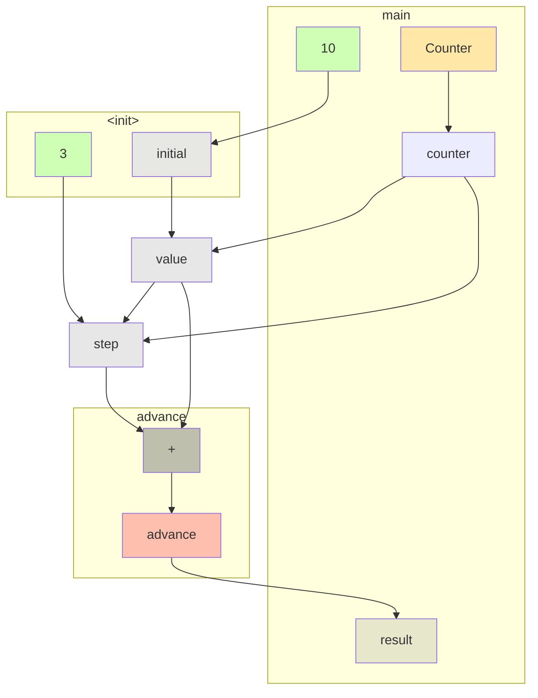

# implicitThis: spike value graph (condensed)

```mermaid
flowchart TD
  subgraph m0["main"]
    n0["Counter"]:::EXTERNAL
    n1["10"]:::LITERAL
    n2["counter"]:::OBJ_VARIABLE
    n3["result"]:::VARIABLE
  end
  subgraph m1["#lt;init#gt;"]
    n4["initial"]:::FUNC_PARAM
    n5["3"]:::LITERAL
  end
  subgraph m2["advance"]
    n6["+"]:::BIN_OP
    n7["advance"]:::RETURN
  end
  n8["step"]:::VARIABLE
  n9["value"]:::VARIABLE
  n0 --> n2
  n1 --> n4
  n2 --> n8
  n2 --> n9
  n4 --> n9
  n5 --> n8
  n6 --> n7
  n7 --> n3
  n8 --> n6
  n9 --> n6
  n9 --> n8
  classDef LITERAL fill:#00FF0030
  classDef VARIABLE fill:#80808030
  classDef BIN_OP fill:#80808080
  classDef FUNC_PARAM fill:#8080FF30
  classDef RETURN fill:#FF808080
  classDef EXTERNAL fill:#FFA50040
  classDef UNMODELLED fill:#FF000030,stroke-dasharray: 4 2
```
