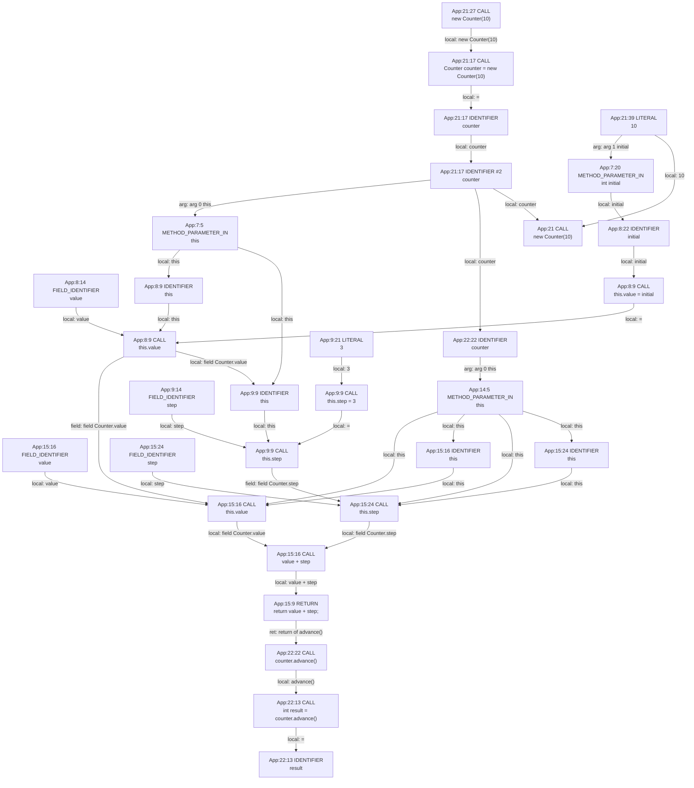

# implicitThis: spike value graph

```mermaid
flowchart TD
  n0["App:14:5 METHOD_PARAMETER_IN<br/>this"]
  n1["App:15:16 CALL<br/>this.value"]
  n2["App:15:16 CALL<br/>value + step"]
  n3["App:15:16 FIELD_IDENTIFIER<br/>value"]
  n4["App:15:16 IDENTIFIER<br/>this"]
  n5["App:15:24 CALL<br/>this.step"]
  n6["App:15:24 FIELD_IDENTIFIER<br/>step"]
  n7["App:15:24 IDENTIFIER<br/>this"]
  n8["App:15:9 RETURN<br/>return value + step;"]
  n9["App:21 CALL<br/>new Counter(10)"]
  n10["App:21:17 CALL<br/>Counter counter = new Counter(10)"]
  n11["App:21:17 IDENTIFIER #2<br/>counter"]
  n12["App:21:17 IDENTIFIER<br/>counter"]
  n13["App:21:27 CALL<br/>new Counter(10)"]
  n14["App:21:39 LITERAL<br/>10"]
  n15["App:22:13 CALL<br/>int result = counter.advance()"]
  n16["App:22:13 IDENTIFIER<br/>result"]
  n17["App:22:22 CALL<br/>counter.advance()"]
  n18["App:22:22 IDENTIFIER<br/>counter"]
  n19["App:7:20 METHOD_PARAMETER_IN<br/>int initial"]
  n20["App:7:5 METHOD_PARAMETER_IN<br/>this"]
  n21["App:8:14 FIELD_IDENTIFIER<br/>value"]
  n22["App:8:22 IDENTIFIER<br/>initial"]
  n23["App:8:9 CALL<br/>this.value"]
  n24["App:8:9 CALL<br/>this.value = initial"]
  n25["App:8:9 IDENTIFIER<br/>this"]
  n26["App:9:14 FIELD_IDENTIFIER<br/>step"]
  n27["App:9:21 LITERAL<br/>3"]
  n28["App:9:9 CALL<br/>this.step"]
  n29["App:9:9 CALL<br/>this.step = 3"]
  n30["App:9:9 IDENTIFIER<br/>this"]
  n0 -->|"local: this"| n1
  n0 -->|"local: this"| n4
  n0 -->|"local: this"| n5
  n0 -->|"local: this"| n7
  n1 -->|"local: field Counter.value"| n2
  n10 -->|"local: ="| n12
  n11 -->|"arg: arg 0 this"| n20
  n11 -->|"local: counter"| n18
  n11 -->|"local: counter"| n9
  n12 -->|"local: counter"| n11
  n13 -->|"local: new Counter(10)"| n10
  n14 -->|"arg: arg 1 initial"| n19
  n14 -->|"local: 10"| n9
  n15 -->|"local: ="| n16
  n17 -->|"local: advance()"| n15
  n18 -->|"arg: arg 0 this"| n0
  n19 -->|"local: initial"| n22
  n2 -->|"local: value + step"| n8
  n20 -->|"local: this"| n25
  n20 -->|"local: this"| n30
  n21 -->|"local: value"| n23
  n22 -->|"local: initial"| n24
  n23 -->|"field: field Counter.value"| n1
  n23 -->|"local: field Counter.value"| n30
  n24 -->|"local: ="| n23
  n25 -->|"local: this"| n23
  n26 -->|"local: step"| n28
  n27 -->|"local: 3"| n29
  n28 -->|"field: field Counter.step"| n5
  n29 -->|"local: ="| n28
  n3 -->|"local: value"| n1
  n30 -->|"local: this"| n28
  n4 -->|"local: this"| n1
  n5 -->|"local: field Counter.step"| n2
  n6 -->|"local: step"| n5
  n7 -->|"local: this"| n5
  n8 -->|"ret: return of advance()"| n17
```
