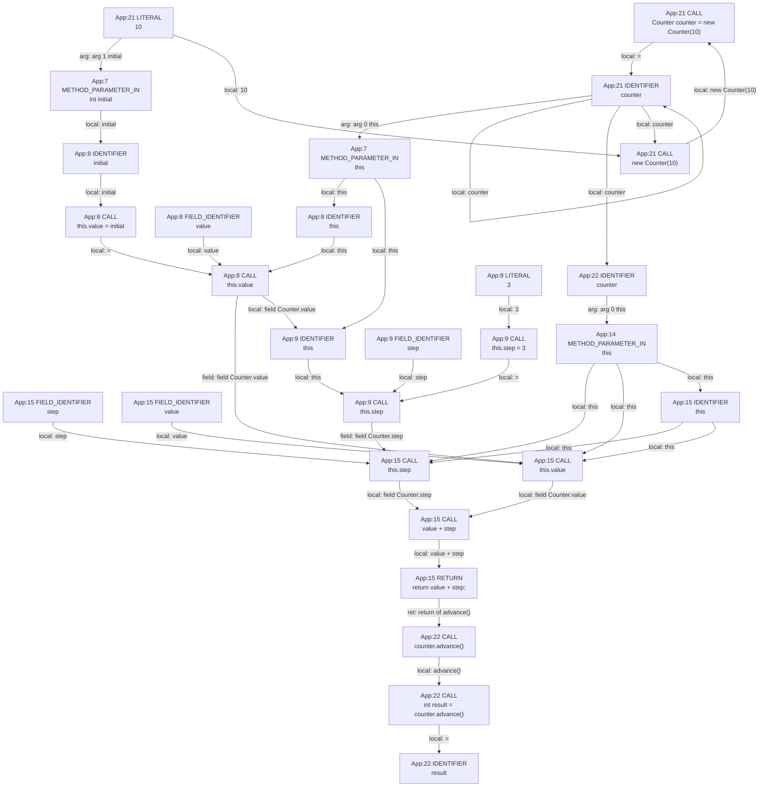

# implicitThis: spike value graph

```mermaid
flowchart TD
  n0["App:14 METHOD_PARAMETER_IN<br/>this"]
  n1["App:15 CALL<br/>this.step"]
  n2["App:15 CALL<br/>this.value"]
  n3["App:15 CALL<br/>value + step"]
  n4["App:15 FIELD_IDENTIFIER<br/>step"]
  n5["App:15 FIELD_IDENTIFIER<br/>value"]
  n6["App:15 IDENTIFIER<br/>this"]
  n7["App:15 RETURN<br/>return value + step;"]
  n8["App:21 CALL<br/>Counter counter = new Counter(10)"]
  n9["App:21 CALL<br/>new Counter(10)"]
  n10["App:21 IDENTIFIER<br/>counter"]
  n11["App:21 LITERAL<br/>10"]
  n12["App:22 CALL<br/>counter.advance()"]
  n13["App:22 CALL<br/>int result = counter.advance()"]
  n14["App:22 IDENTIFIER<br/>counter"]
  n15["App:22 IDENTIFIER<br/>result"]
  n16["App:7 METHOD_PARAMETER_IN<br/>int initial"]
  n17["App:7 METHOD_PARAMETER_IN<br/>this"]
  n18["App:8 CALL<br/>this.value"]
  n19["App:8 CALL<br/>this.value = initial"]
  n20["App:8 FIELD_IDENTIFIER<br/>value"]
  n21["App:8 IDENTIFIER<br/>initial"]
  n22["App:8 IDENTIFIER<br/>this"]
  n23["App:9 CALL<br/>this.step"]
  n24["App:9 CALL<br/>this.step = 3"]
  n25["App:9 FIELD_IDENTIFIER<br/>step"]
  n26["App:9 IDENTIFIER<br/>this"]
  n27["App:9 LITERAL<br/>3"]
  n0 -->|"local: this"| n1
  n0 -->|"local: this"| n2
  n0 -->|"local: this"| n6
  n1 -->|"local: field Counter.step"| n3
  n10 -->|"arg: arg 0 this"| n17
  n10 -->|"local: counter"| n10
  n10 -->|"local: counter"| n14
  n10 -->|"local: counter"| n9
  n11 -->|"arg: arg 1 initial"| n16
  n11 -->|"local: 10"| n9
  n12 -->|"local: advance()"| n13
  n13 -->|"local: ="| n15
  n14 -->|"arg: arg 0 this"| n0
  n16 -->|"local: initial"| n21
  n17 -->|"local: this"| n22
  n17 -->|"local: this"| n26
  n18 -->|"field: field Counter.value"| n2
  n18 -->|"local: field Counter.value"| n26
  n19 -->|"local: ="| n18
  n2 -->|"local: field Counter.value"| n3
  n20 -->|"local: value"| n18
  n21 -->|"local: initial"| n19
  n22 -->|"local: this"| n18
  n23 -->|"field: field Counter.step"| n1
  n24 -->|"local: ="| n23
  n25 -->|"local: step"| n23
  n26 -->|"local: this"| n23
  n27 -->|"local: 3"| n24
  n3 -->|"local: value + step"| n7
  n4 -->|"local: step"| n1
  n5 -->|"local: value"| n2
  n6 -->|"local: this"| n1
  n6 -->|"local: this"| n2
  n7 -->|"ret: return of advance()"| n12
  n8 -->|"local: ="| n10
  n9 -->|"local: new Counter(10)"| n8
```
