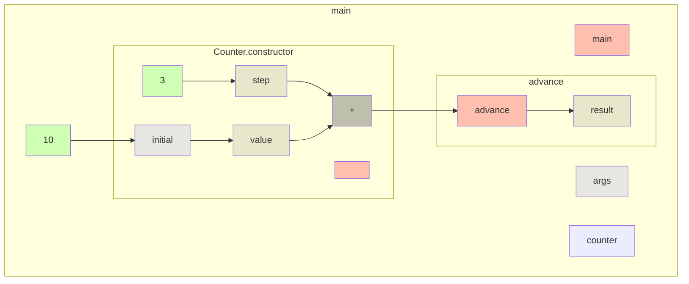

```mermaid
flowchart TD
  subgraph 4309014["main"]
    -16976734907[result]:::VARIABLE
    -1091460147[10]:::LITERAL
    -1040558433[args]:::FUNC_PARAM
    56853577[main]:::RETURN
    15191604726[counter]:::OBJ_VARIABLE
    -1091460147[10]:::LITERAL --> 34579102621[initial]:::FUNC_PARAM
    subgraph -1727213445["Counter.constructor"]
      -1031319091[step]:::VARIABLE
      812025538[value]:::VARIABLE
      1457348510[3]:::LITERAL
      29816195027[<init>]:::RETURN
      34579102621[initial]:::FUNC_PARAM
      -1031319091[step]:::VARIABLE --> -568050062[+]:::BIN_OP
      812025538[value]:::VARIABLE --> -568050062[+]:::BIN_OP
      1457348510[3]:::LITERAL --> -1031319091[step]:::VARIABLE
      34579102621[initial]:::FUNC_PARAM --> 812025538[value]:::VARIABLE
    end
    subgraph -1726037844["advance"]
      -20328117504[advance]:::RETURN
      -568050062[+]:::BIN_OP
      -20328117504[advance]:::RETURN --> -16976734907[result]:::VARIABLE
      -568050062[+]:::BIN_OP --> -20328117504[advance]:::RETURN
    end
  end
  classDef LITERAL fill:#00FF0030
  classDef VARIABLE fill:#80808030
  classDef BIN_OP fill:#80808080
  classDef FUNC_PARAM fill:#8080FF30
  classDef RETURN fill:#FF808080
  classDef EXTERNAL fill:#FFA50040
```
