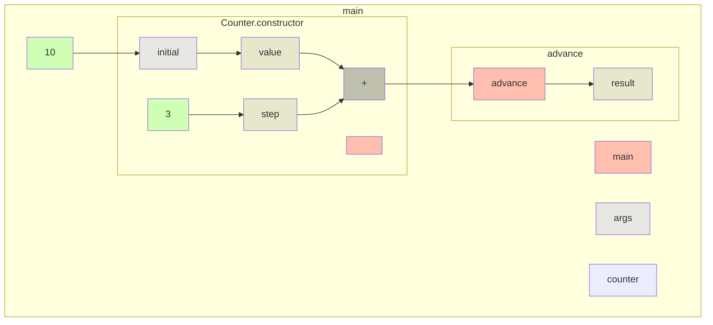

```mermaid
flowchart TD
  subgraph b0["main"]
    n1[main]:::RETURN
    n2[args]:::FUNC_PARAM
    n3[counter]:::OBJ_VARIABLE
    n7[10]:::LITERAL
    n11[result]:::VARIABLE
    n7[10]:::LITERAL --> n6[initial]:::FUNC_PARAM
    subgraph b4["Counter.constructor"]
      n5[<init>]:::RETURN
      n6[initial]:::FUNC_PARAM
      n8[value]:::VARIABLE
      n9[step]:::VARIABLE
      n10[3]:::LITERAL
      n6[initial]:::FUNC_PARAM --> n8[value]:::VARIABLE
      n8[value]:::VARIABLE --> n14[+]:::BIN_OP
      n9[step]:::VARIABLE --> n14[+]:::BIN_OP
      n10[3]:::LITERAL --> n9[step]:::VARIABLE
    end
    subgraph b12["advance"]
      n13[advance]:::RETURN
      n14[+]:::BIN_OP
      n13[advance]:::RETURN --> n11[result]:::VARIABLE
      n14[+]:::BIN_OP --> n13[advance]:::RETURN
    end
  end
  classDef LITERAL fill:#00FF0030
  classDef VARIABLE fill:#80808030
  classDef BIN_OP fill:#80808080
  classDef FUNC_PARAM fill:#8080FF30
  classDef RETURN fill:#FF808080
  classDef EXTERNAL fill:#FFA50040
```
