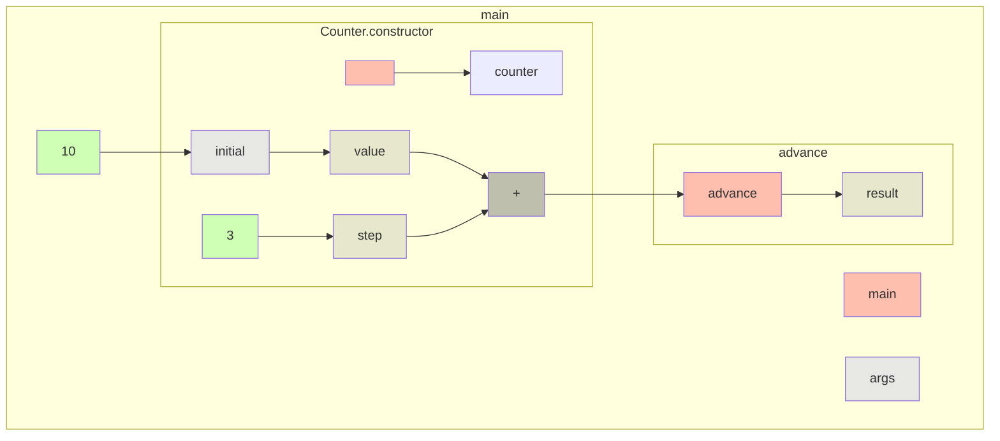

```mermaid
flowchart TD
  subgraph b0["main"]
    n1[main]:::RETURN
    n2[args]:::FUNC_PARAM
    n3[10]:::LITERAL
    n10[counter]:::OBJ_VARIABLE
    n14[result]:::VARIABLE
    n3[10]:::LITERAL --> n6[initial]:::FUNC_PARAM
    subgraph b4["Counter.constructor"]
      n5[<init>]:::RETURN
      n6[initial]:::FUNC_PARAM
      n7[value]:::VARIABLE
      n8[3]:::LITERAL
      n9[step]:::VARIABLE
      n5[<init>]:::RETURN --> n10[counter]:::OBJ_VARIABLE
      n6[initial]:::FUNC_PARAM --> n7[value]:::VARIABLE
      n7[value]:::VARIABLE --> n13[+]:::BIN_OP
      n8[3]:::LITERAL --> n9[step]:::VARIABLE
      n9[step]:::VARIABLE --> n13[+]:::BIN_OP
    end
    subgraph b11["advance"]
      n12[advance]:::RETURN
      n13[+]:::BIN_OP
      n12[advance]:::RETURN --> n14[result]:::VARIABLE
      n13[+]:::BIN_OP --> n12[advance]:::RETURN
    end
  end
  classDef LITERAL fill:#00FF0030
  classDef VARIABLE fill:#80808030
  classDef BIN_OP fill:#80808080
  classDef FUNC_PARAM fill:#8080FF30
  classDef RETURN fill:#FF808080
  classDef EXTERNAL fill:#FFA50040
```
