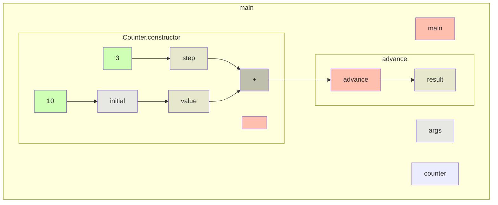

```mermaid
flowchart TD
  subgraph 4309014["main"]
    -17656148279[result]:::VARIABLE
    -1719910522[args]:::FUNC_PARAM
    56853577[main]:::RETURN
    14512224793[counter]:::OBJ_VARIABLE
    subgraph -1094673613["Counter.constructor"]
      -1710704603[step]:::VARIABLE
      -834442533[3]:::LITERAL
      -834413788[10]:::LITERAL
      132640026[value]:::VARIABLE
      29136809515[<init>]:::RETURN
      31230263968[initial]:::FUNC_PARAM
      -1710704603[step]:::VARIABLE --> -834437614[+]:::BIN_OP
      -834442533[3]:::LITERAL --> -1710704603[step]:::VARIABLE
      -834413788[10]:::LITERAL --> 31230263968[initial]:::FUNC_PARAM
      132640026[value]:::VARIABLE --> -834437614[+]:::BIN_OP
      31230263968[initial]:::FUNC_PARAM --> 132640026[value]:::VARIABLE
    end
    subgraph -1094669876["advance"]
      -21007534688[advance]:::RETURN
      -834437614[+]:::BIN_OP
      -21007534688[advance]:::RETURN --> -17656148279[result]:::VARIABLE
      -834437614[+]:::BIN_OP --> -21007534688[advance]:::RETURN
    end
  end
  classDef LITERAL fill:#00FF0030
  classDef VARIABLE fill:#80808030
  classDef BIN_OP fill:#80808080
  classDef FUNC_PARAM fill:#8080FF30
  classDef RETURN fill:#FF808080
```
