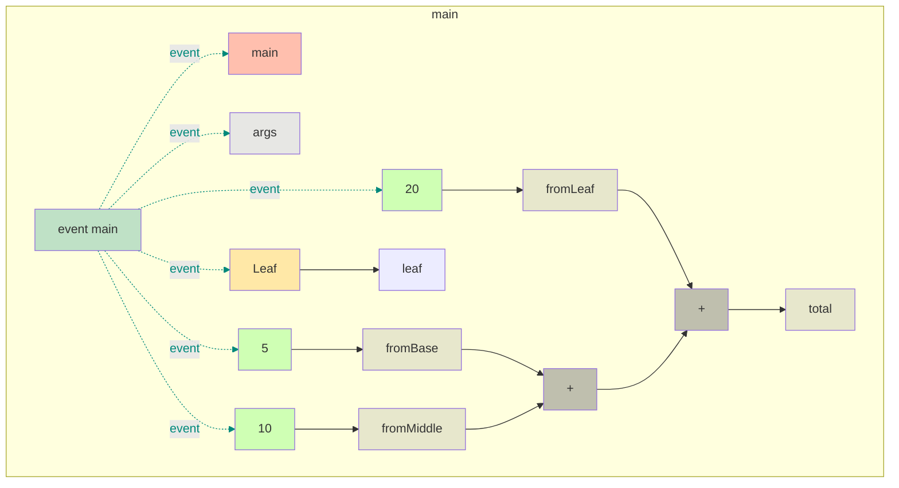

```mermaid
flowchart TD
  subgraph b0["main"]
    n1[event main]:::EVENT
    n2[main]:::RETURN
    n3[args]:::FUNC_PARAM
    n4[Leaf]:::EXTERNAL
    n5[leaf]:::OBJ_VARIABLE
    n6[5]:::LITERAL
    n7[fromBase]:::VARIABLE
    n8[10]:::LITERAL
    n9[fromMiddle]:::VARIABLE
    n10[20]:::LITERAL
    n11[fromLeaf]:::VARIABLE
    n12[+]:::BIN_OP
    n13[+]:::BIN_OP
    n14[total]:::VARIABLE
    n1[event main]:::EVENT -. event .-> n2[main]:::RETURN
    n1[event main]:::EVENT -. event .-> n3[args]:::FUNC_PARAM
    n1[event main]:::EVENT -. event .-> n4[Leaf]:::EXTERNAL
    n1[event main]:::EVENT -. event .-> n6[5]:::LITERAL
    n1[event main]:::EVENT -. event .-> n8[10]:::LITERAL
    n1[event main]:::EVENT -. event .-> n10[20]:::LITERAL
    n4[Leaf]:::EXTERNAL --> n5[leaf]:::OBJ_VARIABLE
    n6[5]:::LITERAL --> n7[fromBase]:::VARIABLE
    n7[fromBase]:::VARIABLE --> n12[+]:::BIN_OP
    n8[10]:::LITERAL --> n9[fromMiddle]:::VARIABLE
    n9[fromMiddle]:::VARIABLE --> n12[+]:::BIN_OP
    n10[20]:::LITERAL --> n11[fromLeaf]:::VARIABLE
    n11[fromLeaf]:::VARIABLE --> n13[+]:::BIN_OP
    n12[+]:::BIN_OP --> n13[+]:::BIN_OP
    n13[+]:::BIN_OP --> n14[total]:::VARIABLE
  end
  linkStyle 0 stroke:#00897b,color:#00897b
  linkStyle 1 stroke:#00897b,color:#00897b
  linkStyle 2 stroke:#00897b,color:#00897b
  linkStyle 3 stroke:#00897b,color:#00897b
  linkStyle 4 stroke:#00897b,color:#00897b
  linkStyle 5 stroke:#00897b,color:#00897b
  classDef LITERAL fill:#00FF0030
  classDef VARIABLE fill:#80808030
  classDef BIN_OP fill:#80808080
  classDef FUNC_PARAM fill:#8080FF30
  classDef RETURN fill:#FF808080
  classDef EXTERNAL fill:#FFA50040
  classDef UNMODELLED fill:#FF000030,stroke-dasharray: 4 2
  classDef EVENT fill:#00897B40
```
