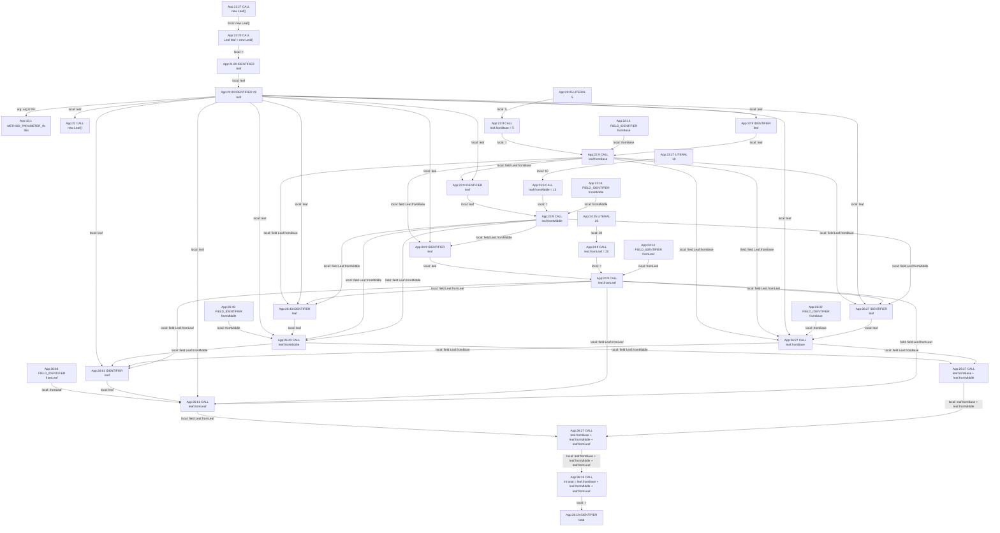

# inheritance: spike value graph

```mermaid
flowchart TD
  n0["App:15:1 METHOD_PARAMETER_IN<br/>this"]
  n1["App:21 CALL<br/>new Leaf()"]
  n2["App:21:20 CALL<br/>Leaf leaf = new Leaf()"]
  n3["App:21:20 IDENTIFIER #2<br/>leaf"]
  n4["App:21:20 IDENTIFIER<br/>leaf"]
  n5["App:21:27 CALL<br/>new Leaf()"]
  n6["App:22:14 FIELD_IDENTIFIER<br/>fromBase"]
  n7["App:22:25 LITERAL<br/>5"]
  n8["App:22:9 CALL<br/>leaf.fromBase"]
  n9["App:22:9 CALL<br/>leaf.fromBase = 5"]
  n10["App:22:9 IDENTIFIER<br/>leaf"]
  n11["App:23:14 FIELD_IDENTIFIER<br/>fromMiddle"]
  n12["App:23:27 LITERAL<br/>10"]
  n13["App:23:9 CALL<br/>leaf.fromMiddle"]
  n14["App:23:9 CALL<br/>leaf.fromMiddle = 10"]
  n15["App:23:9 IDENTIFIER<br/>leaf"]
  n16["App:24:14 FIELD_IDENTIFIER<br/>fromLeaf"]
  n17["App:24:25 LITERAL<br/>20"]
  n18["App:24:9 CALL<br/>leaf.fromLeaf"]
  n19["App:24:9 CALL<br/>leaf.fromLeaf = 20"]
  n20["App:24:9 IDENTIFIER<br/>leaf"]
  n21["App:26:19 CALL<br/>int total = leaf.fromBase + leaf.fromMiddle + leaf.fromLeaf"]
  n22["App:26:19 IDENTIFIER<br/>total"]
  n23["App:26:27 CALL<br/>leaf.fromBase"]
  n24["App:26:27 CALL<br/>leaf.fromBase + leaf.fromMiddle"]
  n25["App:26:27 CALL<br/>leaf.fromBase + leaf.fromMiddle + leaf.fromLeaf"]
  n26["App:26:27 IDENTIFIER<br/>leaf"]
  n27["App:26:32 FIELD_IDENTIFIER<br/>fromBase"]
  n28["App:26:43 CALL<br/>leaf.fromMiddle"]
  n29["App:26:43 IDENTIFIER<br/>leaf"]
  n30["App:26:48 FIELD_IDENTIFIER<br/>fromMiddle"]
  n31["App:26:61 CALL<br/>leaf.fromLeaf"]
  n32["App:26:61 IDENTIFIER<br/>leaf"]
  n33["App:26:66 FIELD_IDENTIFIER<br/>fromLeaf"]
  n10 -->|"local: leaf"| n8
  n11 -->|"local: fromMiddle"| n13
  n12 -->|"local: 10"| n14
  n13 -->|"field: field Leaf.fromMiddle"| n28
  n13 -->|"local: field Leaf.fromMiddle"| n20
  n13 -->|"local: field Leaf.fromMiddle"| n26
  n13 -->|"local: field Leaf.fromMiddle"| n28
  n13 -->|"local: field Leaf.fromMiddle"| n29
  n14 -->|"local: ="| n13
  n15 -->|"local: leaf"| n13
  n16 -->|"local: fromLeaf"| n18
  n17 -->|"local: 20"| n19
  n18 -->|"field: field Leaf.fromLeaf"| n31
  n18 -->|"local: field Leaf.fromLeaf"| n26
  n18 -->|"local: field Leaf.fromLeaf"| n29
  n18 -->|"local: field Leaf.fromLeaf"| n31
  n18 -->|"local: field Leaf.fromLeaf"| n32
  n19 -->|"local: ="| n18
  n2 -->|"local: ="| n4
  n20 -->|"local: leaf"| n18
  n21 -->|"local: ="| n22
  n23 -->|"local: field Leaf.fromBase"| n24
  n23 -->|"local: field Leaf.fromBase"| n32
  n24 -->|"local: leaf.fromBase + leaf.fromMiddle"| n25
  n25 -->|"local: leaf.fromBase + leaf.fromMiddle + leaf.fromLeaf"| n21
  n26 -->|"local: leaf"| n23
  n27 -->|"local: fromBase"| n23
  n28 -->|"local: field Leaf.fromMiddle"| n24
  n28 -->|"local: field Leaf.fromMiddle"| n32
  n29 -->|"local: leaf"| n28
  n3 -->|"arg: arg 0 this"| n0
  n3 -->|"local: leaf"| n1
  n3 -->|"local: leaf"| n10
  n3 -->|"local: leaf"| n15
  n3 -->|"local: leaf"| n20
  n3 -->|"local: leaf"| n23
  n3 -->|"local: leaf"| n26
  n3 -->|"local: leaf"| n28
  n3 -->|"local: leaf"| n29
  n3 -->|"local: leaf"| n31
  n3 -->|"local: leaf"| n32
  n30 -->|"local: fromMiddle"| n28
  n31 -->|"local: field Leaf.fromLeaf"| n25
  n32 -->|"local: leaf"| n31
  n33 -->|"local: fromLeaf"| n31
  n4 -->|"local: leaf"| n3
  n5 -->|"local: new Leaf()"| n2
  n6 -->|"local: fromBase"| n8
  n7 -->|"local: 5"| n9
  n8 -->|"field: field Leaf.fromBase"| n23
  n8 -->|"local: field Leaf.fromBase"| n15
  n8 -->|"local: field Leaf.fromBase"| n20
  n8 -->|"local: field Leaf.fromBase"| n23
  n8 -->|"local: field Leaf.fromBase"| n26
  n8 -->|"local: field Leaf.fromBase"| n29
  n9 -->|"local: ="| n8
```
