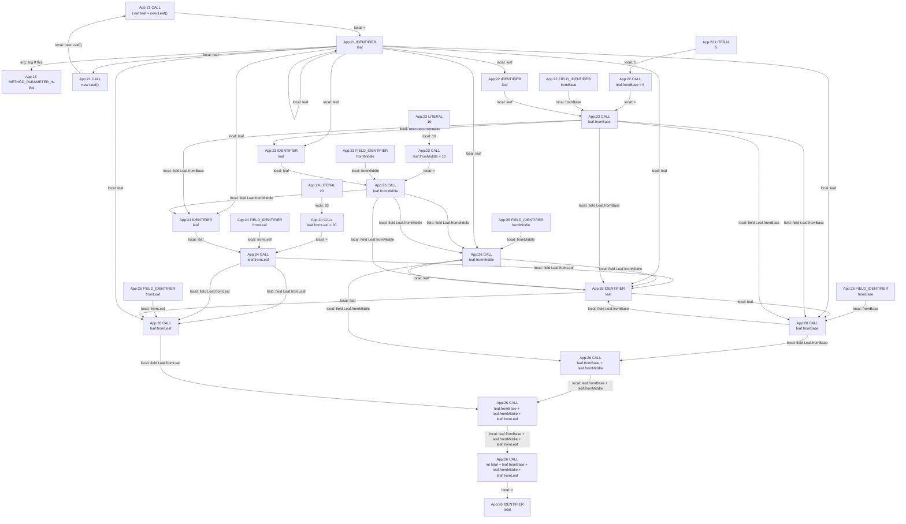

# inheritance: spike value graph

```mermaid
flowchart TD
  n0["App:15 METHOD_PARAMETER_IN<br/>this"]
  n1["App:21 CALL<br/>Leaf leaf = new Leaf()"]
  n2["App:21 CALL<br/>new Leaf()"]
  n3["App:21 IDENTIFIER<br/>leaf"]
  n4["App:22 CALL<br/>leaf.fromBase"]
  n5["App:22 CALL<br/>leaf.fromBase = 5"]
  n6["App:22 FIELD_IDENTIFIER<br/>fromBase"]
  n7["App:22 IDENTIFIER<br/>leaf"]
  n8["App:22 LITERAL<br/>5"]
  n9["App:23 CALL<br/>leaf.fromMiddle"]
  n10["App:23 CALL<br/>leaf.fromMiddle = 10"]
  n11["App:23 FIELD_IDENTIFIER<br/>fromMiddle"]
  n12["App:23 IDENTIFIER<br/>leaf"]
  n13["App:23 LITERAL<br/>10"]
  n14["App:24 CALL<br/>leaf.fromLeaf"]
  n15["App:24 CALL<br/>leaf.fromLeaf = 20"]
  n16["App:24 FIELD_IDENTIFIER<br/>fromLeaf"]
  n17["App:24 IDENTIFIER<br/>leaf"]
  n18["App:24 LITERAL<br/>20"]
  n19["App:26 CALL<br/>int total = leaf.fromBase + leaf.fromMiddle + leaf.fromLeaf"]
  n20["App:26 CALL<br/>leaf.fromBase"]
  n21["App:26 CALL<br/>leaf.fromBase + leaf.fromMiddle"]
  n22["App:26 CALL<br/>leaf.fromBase + leaf.fromMiddle + leaf.fromLeaf"]
  n23["App:26 CALL<br/>leaf.fromLeaf"]
  n24["App:26 CALL<br/>leaf.fromMiddle"]
  n25["App:26 FIELD_IDENTIFIER<br/>fromBase"]
  n26["App:26 FIELD_IDENTIFIER<br/>fromLeaf"]
  n27["App:26 FIELD_IDENTIFIER<br/>fromMiddle"]
  n28["App:26 IDENTIFIER<br/>leaf"]
  n29["App:26 IDENTIFIER<br/>total"]
  n1 -->|"local: ="| n3
  n10 -->|"local: ="| n9
  n11 -->|"local: fromMiddle"| n9
  n12 -->|"local: leaf"| n9
  n13 -->|"local: 10"| n10
  n14 -->|"field: field Leaf.fromLeaf"| n23
  n14 -->|"local: field Leaf.fromLeaf"| n23
  n14 -->|"local: field Leaf.fromLeaf"| n28
  n15 -->|"local: ="| n14
  n16 -->|"local: fromLeaf"| n14
  n17 -->|"local: leaf"| n14
  n18 -->|"local: 20"| n15
  n19 -->|"local: ="| n29
  n2 -->|"local: new Leaf()"| n1
  n20 -->|"local: field Leaf.fromBase"| n21
  n20 -->|"local: field Leaf.fromBase"| n28
  n21 -->|"local: leaf.fromBase + leaf.fromMiddle"| n22
  n22 -->|"local: leaf.fromBase + leaf.fromMiddle + leaf.fromLeaf"| n19
  n23 -->|"local: field Leaf.fromLeaf"| n22
  n24 -->|"local: field Leaf.fromMiddle"| n21
  n24 -->|"local: field Leaf.fromMiddle"| n28
  n25 -->|"local: fromBase"| n20
  n26 -->|"local: fromLeaf"| n23
  n27 -->|"local: fromMiddle"| n24
  n28 -->|"local: leaf"| n20
  n28 -->|"local: leaf"| n23
  n28 -->|"local: leaf"| n24
  n3 -->|"arg: arg 0 this"| n0
  n3 -->|"local: leaf"| n12
  n3 -->|"local: leaf"| n17
  n3 -->|"local: leaf"| n2
  n3 -->|"local: leaf"| n20
  n3 -->|"local: leaf"| n23
  n3 -->|"local: leaf"| n24
  n3 -->|"local: leaf"| n28
  n3 -->|"local: leaf"| n3
  n3 -->|"local: leaf"| n7
  n4 -->|"field: field Leaf.fromBase"| n20
  n4 -->|"local: field Leaf.fromBase"| n12
  n4 -->|"local: field Leaf.fromBase"| n17
  n4 -->|"local: field Leaf.fromBase"| n20
  n4 -->|"local: field Leaf.fromBase"| n28
  n5 -->|"local: ="| n4
  n6 -->|"local: fromBase"| n4
  n7 -->|"local: leaf"| n4
  n8 -->|"local: 5"| n5
  n9 -->|"field: field Leaf.fromMiddle"| n24
  n9 -->|"local: field Leaf.fromMiddle"| n17
  n9 -->|"local: field Leaf.fromMiddle"| n24
  n9 -->|"local: field Leaf.fromMiddle"| n28
```
