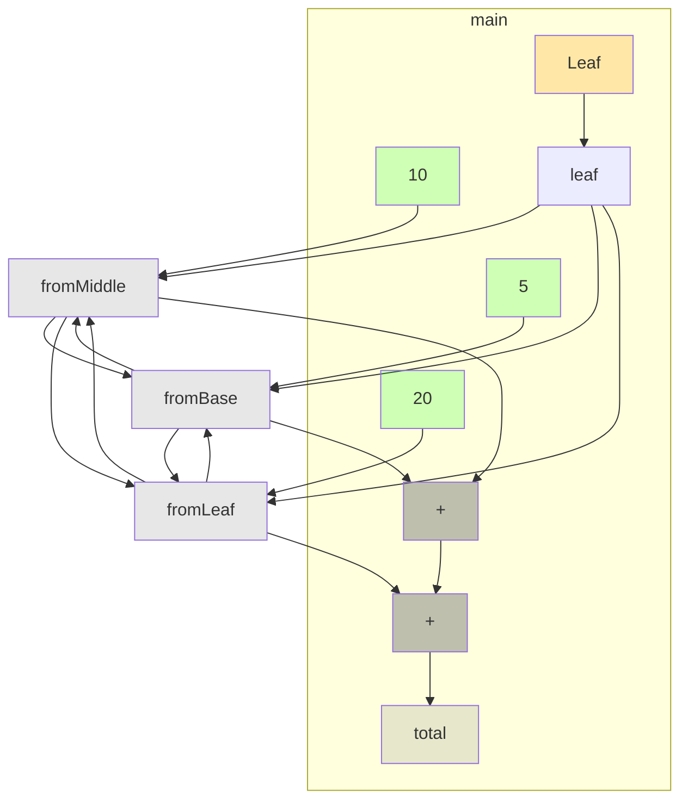

# inheritance: spike value graph (condensed)

```mermaid
flowchart TD
  subgraph m0["main"]
    n0["+"]:::BIN_OP
    n1["+"]:::BIN_OP
    n2["Leaf"]:::EXTERNAL
    n3["10"]:::LITERAL
    n4["20"]:::LITERAL
    n5["5"]:::LITERAL
    n6["leaf"]:::OBJ_VARIABLE
    n7["total"]:::VARIABLE
  end
  n8["fromBase"]:::VARIABLE
  n9["fromLeaf"]:::VARIABLE
  n10["fromMiddle"]:::VARIABLE
  n0 --> n7
  n1 --> n0
  n10 --> n1
  n10 --> n8
  n10 --> n9
  n2 --> n6
  n3 --> n10
  n4 --> n9
  n5 --> n8
  n6 --> n10
  n6 --> n8
  n6 --> n9
  n8 --> n1
  n8 --> n10
  n8 --> n9
  n9 --> n0
  n9 --> n10
  n9 --> n8
  classDef LITERAL fill:#00FF0030
  classDef VARIABLE fill:#80808030
  classDef BIN_OP fill:#80808080
  classDef FUNC_PARAM fill:#8080FF30
  classDef RETURN fill:#FF808080
  classDef EXTERNAL fill:#FFA50040
  classDef UNMODELLED fill:#FF000030,stroke-dasharray: 4 2
```
