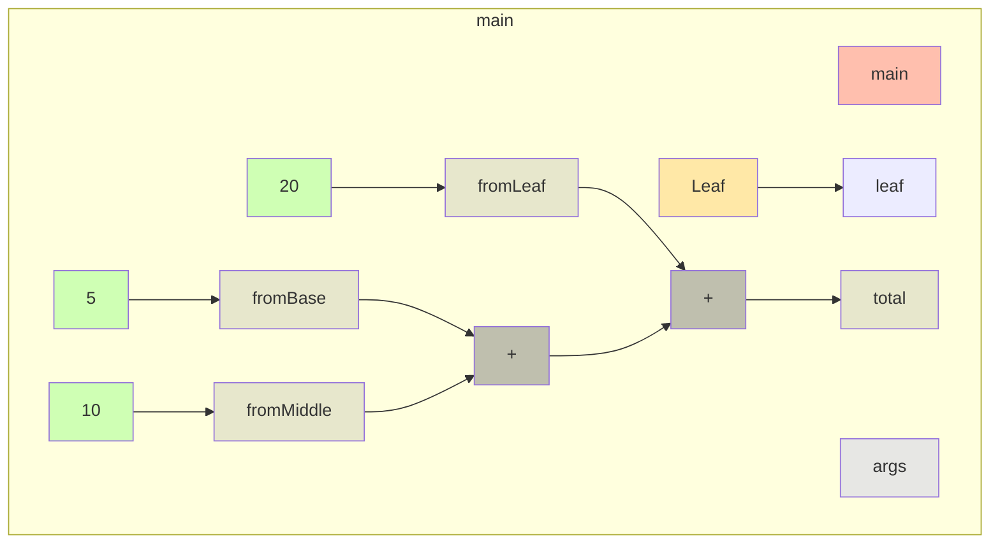

```mermaid
flowchart TD
  subgraph b0["main"]
    n1[main]:::RETURN
    n2[args]:::FUNC_PARAM
    n3[Leaf]:::EXTERNAL
    n4[leaf]:::OBJ_VARIABLE
    n5[5]:::LITERAL
    n6[fromBase]:::VARIABLE
    n7[10]:::LITERAL
    n8[fromMiddle]:::VARIABLE
    n9[20]:::LITERAL
    n10[fromLeaf]:::VARIABLE
    n11[+]:::BIN_OP
    n12[+]:::BIN_OP
    n13[total]:::VARIABLE
    n3[Leaf]:::EXTERNAL --> n4[leaf]:::OBJ_VARIABLE
    n5[5]:::LITERAL --> n6[fromBase]:::VARIABLE
    n6[fromBase]:::VARIABLE --> n11[+]:::BIN_OP
    n7[10]:::LITERAL --> n8[fromMiddle]:::VARIABLE
    n8[fromMiddle]:::VARIABLE --> n11[+]:::BIN_OP
    n9[20]:::LITERAL --> n10[fromLeaf]:::VARIABLE
    n10[fromLeaf]:::VARIABLE --> n12[+]:::BIN_OP
    n11[+]:::BIN_OP --> n12[+]:::BIN_OP
    n12[+]:::BIN_OP --> n13[total]:::VARIABLE
  end
  classDef LITERAL fill:#00FF0030
  classDef VARIABLE fill:#80808030
  classDef BIN_OP fill:#80808080
  classDef FUNC_PARAM fill:#8080FF30
  classDef RETURN fill:#FF808080
  classDef EXTERNAL fill:#FFA50040
```
