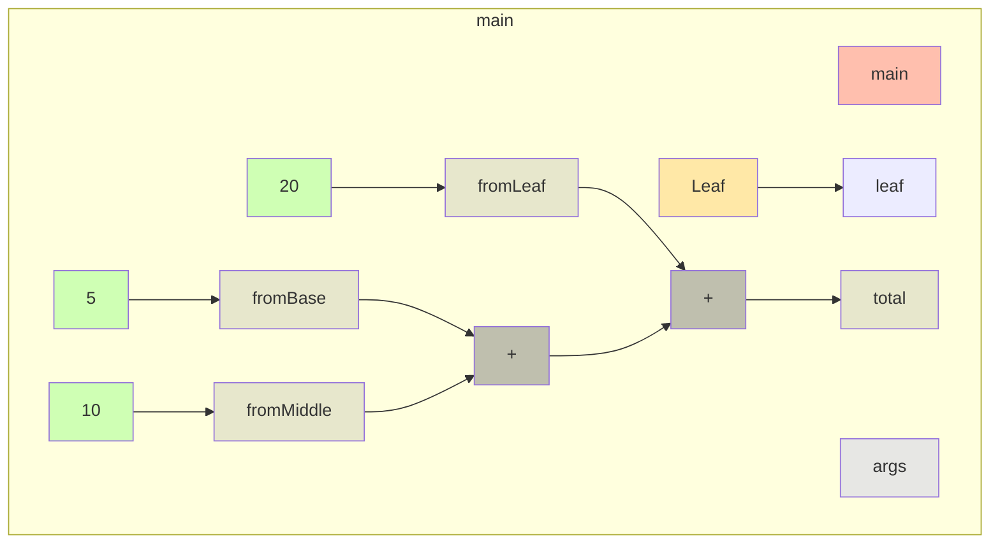

```mermaid
flowchart TD
  subgraph b0["main"]
    n1[main]:::RETURN
    n2[args]:::FUNC_PARAM
    n3[leaf]:::OBJ_VARIABLE
    n4[Leaf]:::EXTERNAL
    n5[fromBase]:::VARIABLE
    n6[5]:::LITERAL
    n7[fromMiddle]:::VARIABLE
    n8[10]:::LITERAL
    n9[fromLeaf]:::VARIABLE
    n10[20]:::LITERAL
    n11[total]:::VARIABLE
    n12[+]:::BIN_OP
    n13[+]:::BIN_OP
    n4[Leaf]:::EXTERNAL --> n3[leaf]:::OBJ_VARIABLE
    n5[fromBase]:::VARIABLE --> n12[+]:::BIN_OP
    n6[5]:::LITERAL --> n5[fromBase]:::VARIABLE
    n7[fromMiddle]:::VARIABLE --> n12[+]:::BIN_OP
    n8[10]:::LITERAL --> n7[fromMiddle]:::VARIABLE
    n9[fromLeaf]:::VARIABLE --> n13[+]:::BIN_OP
    n10[20]:::LITERAL --> n9[fromLeaf]:::VARIABLE
    n12[+]:::BIN_OP --> n13[+]:::BIN_OP
    n13[+]:::BIN_OP --> n11[total]:::VARIABLE
  end
  classDef LITERAL fill:#00FF0030
  classDef VARIABLE fill:#80808030
  classDef BIN_OP fill:#80808080
  classDef FUNC_PARAM fill:#8080FF30
  classDef RETURN fill:#FF808080
  classDef EXTERNAL fill:#FFA50040
```
