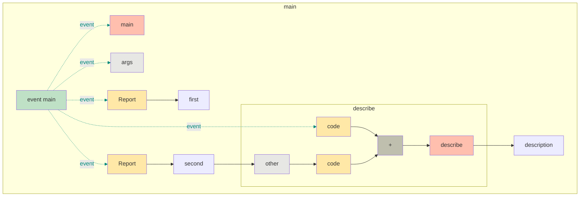

```mermaid
flowchart TD
  subgraph b0["main"]
    n1[event main]:::EVENT
    n2[main]:::RETURN
    n3[args]:::FUNC_PARAM
    n4[Report]:::EXTERNAL
    n5[first]:::OBJ_VARIABLE
    n6[Report]:::EXTERNAL
    n7[second]:::OBJ_VARIABLE
    n14[description]:::OBJ_VARIABLE
    n1[event main]:::EVENT -. event .-> n2[main]:::RETURN
    n1[event main]:::EVENT -. event .-> n3[args]:::FUNC_PARAM
    n1[event main]:::EVENT -. event .-> n4[Report]:::EXTERNAL
    n1[event main]:::EVENT -. event .-> n6[Report]:::EXTERNAL
    n1[event main]:::EVENT -. event .-> n11[code]:::EXTERNAL
    n4[Report]:::EXTERNAL --> n5[first]:::OBJ_VARIABLE
    n6[Report]:::EXTERNAL --> n7[second]:::OBJ_VARIABLE
    n7[second]:::OBJ_VARIABLE --> n10[other]:::FUNC_PARAM
    n9[describe]:::RETURN --> n14[description]:::OBJ_VARIABLE
    subgraph b8["describe"]
      n9[describe]:::RETURN
      n10[other]:::FUNC_PARAM
      n11[code]:::EXTERNAL
      n12[code]:::EXTERNAL
      n13[+]:::BIN_OP
      n10[other]:::FUNC_PARAM --> n12[code]:::EXTERNAL
      n11[code]:::EXTERNAL --> n13[+]:::BIN_OP
      n12[code]:::EXTERNAL --> n13[+]:::BIN_OP
      n13[+]:::BIN_OP --> n9[describe]:::RETURN
    end
  end
  linkStyle 0 stroke:#00897b,color:#00897b
  linkStyle 1 stroke:#00897b,color:#00897b
  linkStyle 2 stroke:#00897b,color:#00897b
  linkStyle 3 stroke:#00897b,color:#00897b
  linkStyle 4 stroke:#00897b,color:#00897b
  classDef LITERAL fill:#00FF0030
  classDef VARIABLE fill:#80808030
  classDef BIN_OP fill:#80808080
  classDef FUNC_PARAM fill:#8080FF30
  classDef RETURN fill:#FF808080
  classDef EXTERNAL fill:#FFA50040
  classDef UNMODELLED fill:#FF000030,stroke-dasharray: 4 2
  classDef EVENT fill:#00897B40
```
