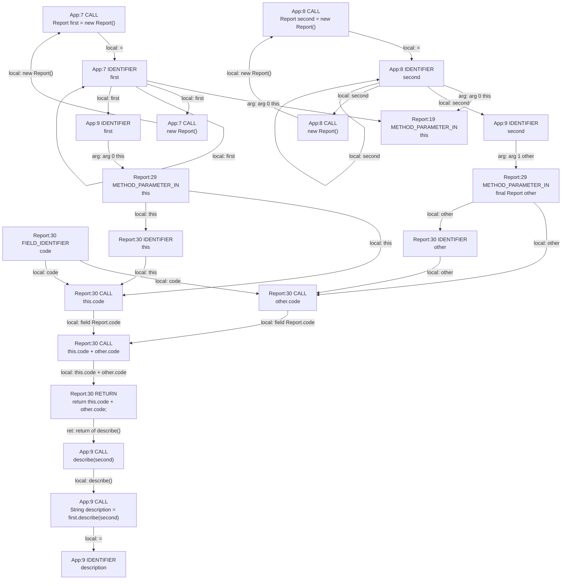

# inheritedField: spike value graph

```mermaid
flowchart TD
  n0["App:7 CALL<br/>Report first = new Report()"]
  n1["App:7 CALL<br/>new Report()"]
  n2["App:7 IDENTIFIER<br/>first"]
  n3["App:8 CALL<br/>Report second = new Report()"]
  n4["App:8 CALL<br/>new Report()"]
  n5["App:8 IDENTIFIER<br/>second"]
  n6["App:9 CALL<br/>String description = first.describe(second)"]
  n7["App:9 CALL<br/>describe(second)"]
  n8["App:9 IDENTIFIER<br/>description"]
  n9["App:9 IDENTIFIER<br/>first"]
  n10["App:9 IDENTIFIER<br/>second"]
  n11["Report:19 METHOD_PARAMETER_IN<br/>this"]
  n12["Report:29 METHOD_PARAMETER_IN<br/>final Report other"]
  n13["Report:29 METHOD_PARAMETER_IN<br/>this"]
  n14["Report:30 CALL<br/>other.code"]
  n15["Report:30 CALL<br/>this.code"]
  n16["Report:30 CALL<br/>this.code + other.code"]
  n17["Report:30 FIELD_IDENTIFIER<br/>code"]
  n18["Report:30 IDENTIFIER<br/>other"]
  n19["Report:30 IDENTIFIER<br/>this"]
  n20["Report:30 RETURN<br/>return this.code + other.code;"]
  n0 -->|"local: ="| n2
  n1 -->|"local: new Report()"| n0
  n10 -->|"arg: arg 1 other"| n12
  n12 -->|"local: other"| n14
  n12 -->|"local: other"| n18
  n13 -->|"local: this"| n15
  n13 -->|"local: this"| n19
  n14 -->|"local: field Report.code"| n16
  n15 -->|"local: field Report.code"| n16
  n16 -->|"local: this.code + other.code"| n20
  n17 -->|"local: code"| n14
  n17 -->|"local: code"| n15
  n18 -->|"local: other"| n14
  n19 -->|"local: this"| n15
  n2 -->|"arg: arg 0 this"| n11
  n2 -->|"local: first"| n1
  n2 -->|"local: first"| n2
  n2 -->|"local: first"| n9
  n20 -->|"ret: return of describe()"| n7
  n3 -->|"local: ="| n5
  n4 -->|"local: new Report()"| n3
  n5 -->|"arg: arg 0 this"| n11
  n5 -->|"local: second"| n10
  n5 -->|"local: second"| n4
  n5 -->|"local: second"| n5
  n6 -->|"local: ="| n8
  n7 -->|"local: describe()"| n6
  n9 -->|"arg: arg 0 this"| n13
```
