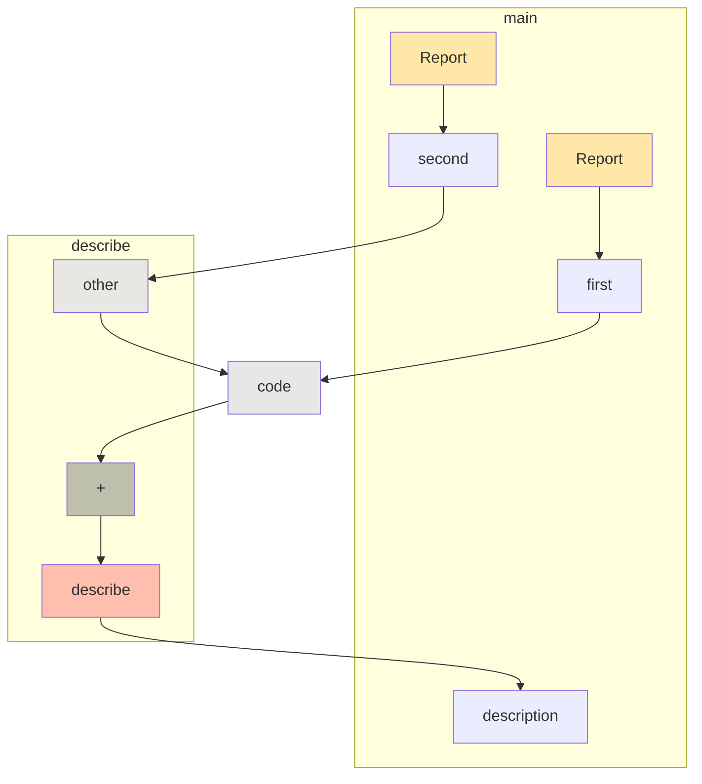

# inheritedField: spike value graph (condensed)

```mermaid
flowchart TD
  subgraph m0["main"]
    n0["Report"]:::EXTERNAL
    n1["Report"]:::EXTERNAL
    n2["description"]:::OBJ_VARIABLE
    n3["first"]:::OBJ_VARIABLE
    n4["second"]:::OBJ_VARIABLE
  end
  subgraph m1["describe"]
    n5["+"]:::BIN_OP
    n6["other"]:::FUNC_PARAM
    n7["describe"]:::RETURN
  end
  n8["code"]:::VARIABLE
  n0 --> n3
  n1 --> n4
  n3 --> n8
  n4 --> n6
  n5 --> n7
  n6 --> n8
  n7 --> n2
  n8 --> n5
  classDef LITERAL fill:#00FF0030
  classDef VARIABLE fill:#80808030
  classDef BIN_OP fill:#80808080
  classDef FUNC_PARAM fill:#8080FF30
  classDef RETURN fill:#FF808080
  classDef EXTERNAL fill:#FFA50040
  classDef UNMODELLED fill:#FF000030,stroke-dasharray: 4 2
```
