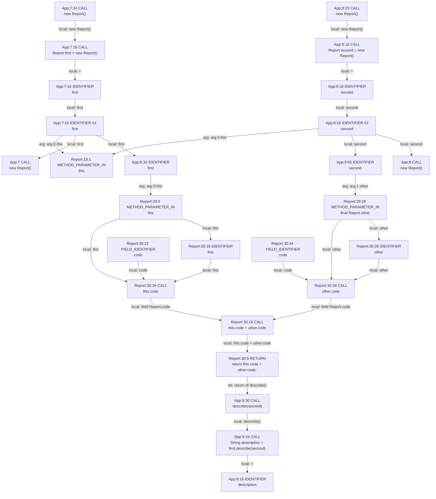

# inheritedField: spike value graph

```mermaid
flowchart TD
  n0["App:7 CALL<br/>new Report()"]
  n1["App:7:16 CALL<br/>Report first = new Report()"]
  n2["App:7:16 IDENTIFIER #2<br/>first"]
  n3["App:7:16 IDENTIFIER<br/>first"]
  n4["App:7:24 CALL<br/>new Report()"]
  n5["App:8 CALL<br/>new Report()"]
  n6["App:8:16 CALL<br/>Report second = new Report()"]
  n7["App:8:16 IDENTIFIER #2<br/>second"]
  n8["App:8:16 IDENTIFIER<br/>second"]
  n9["App:8:25 CALL<br/>new Report()"]
  n10["App:9:16 CALL<br/>String description = first.describe(second)"]
  n11["App:9:16 IDENTIFIER<br/>description"]
  n12["App:9:30 CALL<br/>describe(second)"]
  n13["App:9:30 IDENTIFIER<br/>first"]
  n14["App:9:45 IDENTIFIER<br/>second"]
  n15["Report:19:1 METHOD_PARAMETER_IN<br/>this"]
  n16["Report:29:28 METHOD_PARAMETER_IN<br/>final Report other"]
  n17["Report:29:5 METHOD_PARAMETER_IN<br/>this"]
  n18["Report:30:16 CALL<br/>this.code"]
  n19["Report:30:16 CALL<br/>this.code + other.code"]
  n20["Report:30:16 IDENTIFIER<br/>this"]
  n21["Report:30:21 FIELD_IDENTIFIER<br/>code"]
  n22["Report:30:28 CALL<br/>other.code"]
  n23["Report:30:28 IDENTIFIER<br/>other"]
  n24["Report:30:34 FIELD_IDENTIFIER<br/>code"]
  n25["Report:30:9 RETURN<br/>return this.code + other.code;"]
  n1 -->|"local: ="| n3
  n10 -->|"local: ="| n11
  n12 -->|"local: describe()"| n10
  n13 -->|"arg: arg 0 this"| n17
  n14 -->|"arg: arg 1 other"| n16
  n16 -->|"local: other"| n22
  n16 -->|"local: other"| n23
  n17 -->|"local: this"| n18
  n17 -->|"local: this"| n20
  n18 -->|"local: field Report.code"| n19
  n19 -->|"local: this.code + other.code"| n25
  n2 -->|"arg: arg 0 this"| n15
  n2 -->|"local: first"| n0
  n2 -->|"local: first"| n13
  n20 -->|"local: this"| n18
  n21 -->|"local: code"| n18
  n22 -->|"local: field Report.code"| n19
  n23 -->|"local: other"| n22
  n24 -->|"local: code"| n22
  n25 -->|"ret: return of describe()"| n12
  n3 -->|"local: first"| n2
  n4 -->|"local: new Report()"| n1
  n6 -->|"local: ="| n8
  n7 -->|"arg: arg 0 this"| n15
  n7 -->|"local: second"| n14
  n7 -->|"local: second"| n5
  n8 -->|"local: second"| n7
  n9 -->|"local: new Report()"| n6
```
