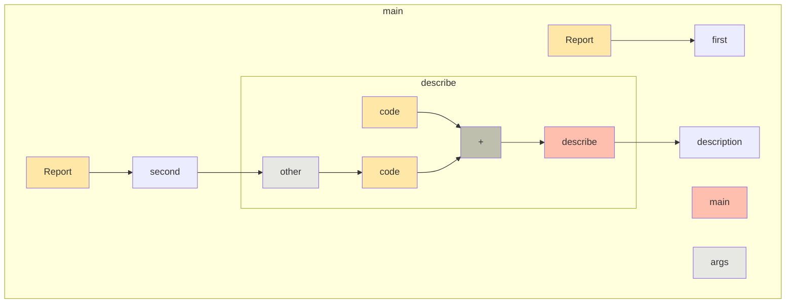

```mermaid
flowchart TD
  subgraph b0["main"]
    n1[main]:::RETURN
    n2[args]:::FUNC_PARAM
    n3[Report]:::EXTERNAL
    n4[first]:::OBJ_VARIABLE
    n5[Report]:::EXTERNAL
    n6[second]:::OBJ_VARIABLE
    n13[description]:::OBJ_VARIABLE
    n3[Report]:::EXTERNAL --> n4[first]:::OBJ_VARIABLE
    n5[Report]:::EXTERNAL --> n6[second]:::OBJ_VARIABLE
    n6[second]:::OBJ_VARIABLE --> n9[other]:::FUNC_PARAM
    n8[describe]:::RETURN --> n13[description]:::OBJ_VARIABLE
    subgraph b7["describe"]
      n8[describe]:::RETURN
      n9[other]:::FUNC_PARAM
      n10[code]:::EXTERNAL
      n11[code]:::EXTERNAL
      n12[+]:::BIN_OP
      n9[other]:::FUNC_PARAM --> n11[code]:::EXTERNAL
      n10[code]:::EXTERNAL --> n12[+]:::BIN_OP
      n11[code]:::EXTERNAL --> n12[+]:::BIN_OP
      n12[+]:::BIN_OP --> n8[describe]:::RETURN
    end
  end
  classDef LITERAL fill:#00FF0030
  classDef VARIABLE fill:#80808030
  classDef BIN_OP fill:#80808080
  classDef FUNC_PARAM fill:#8080FF30
  classDef RETURN fill:#FF808080
  classDef EXTERNAL fill:#FFA50040
  classDef UNMODELLED fill:#FF000030,stroke-dasharray: 4 2
```
