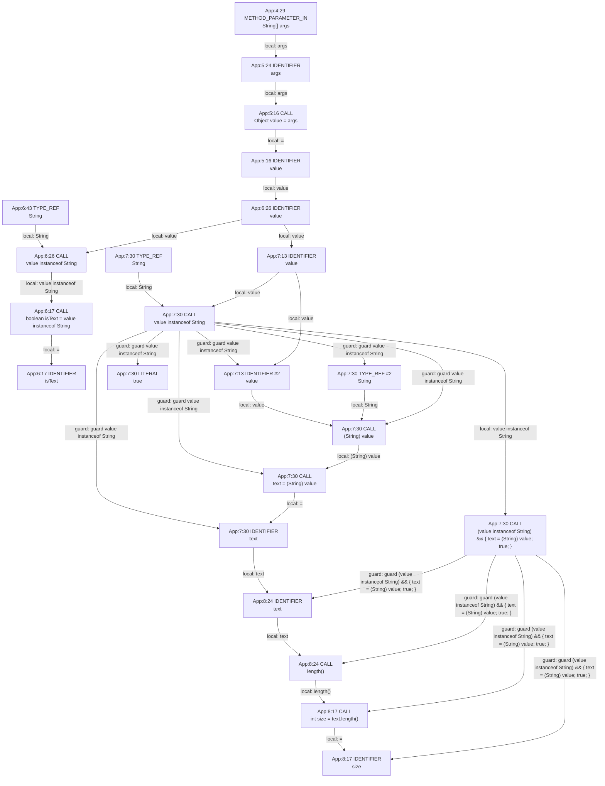

# instanceOf: spike value graph

```mermaid
flowchart TD
  n0["App:4:29 METHOD_PARAMETER_IN<br/>String[] args"]
  n1["App:5:16 CALL<br/>Object value = args"]
  n2["App:5:16 IDENTIFIER<br/>value"]
  n3["App:5:24 IDENTIFIER<br/>args"]
  n4["App:6:17 CALL<br/>boolean isText = value instanceof String"]
  n5["App:6:17 IDENTIFIER<br/>isText"]
  n6["App:6:26 CALL<br/>value instanceof String"]
  n7["App:6:26 IDENTIFIER<br/>value"]
  n8["App:6:43 TYPE_REF<br/>String"]
  n9["App:7:13 IDENTIFIER #2<br/>value"]
  n10["App:7:13 IDENTIFIER<br/>value"]
  n11["App:7:30 CALL<br/>(String) value"]
  n12["App:7:30 CALL<br/>(value instanceof String) && { text = (String) value; true; }"]
  n13["App:7:30 CALL<br/>text = (String) value"]
  n14["App:7:30 CALL<br/>value instanceof String"]
  n15["App:7:30 IDENTIFIER<br/>text"]
  n16["App:7:30 LITERAL<br/>true"]
  n17["App:7:30 TYPE_REF #2<br/>String"]
  n18["App:7:30 TYPE_REF<br/>String"]
  n19["App:8:17 CALL<br/>int size = text.length()"]
  n20["App:8:17 IDENTIFIER<br/>size"]
  n21["App:8:24 CALL<br/>length()"]
  n22["App:8:24 IDENTIFIER<br/>text"]
  n0 -->|"local: args"| n3
  n1 -->|"local: ="| n2
  n10 -->|"local: value"| n14
  n10 -->|"local: value"| n9
  n11 -->|"local: (String) value"| n13
  n12 -->|"guard: guard (value instanceof String) && { text = (String) value; true; }"| n19
  n12 -->|"guard: guard (value instanceof String) && { text = (String) value; true; }"| n20
  n12 -->|"guard: guard (value instanceof String) && { text = (String) value; true; }"| n21
  n12 -->|"guard: guard (value instanceof String) && { text = (String) value; true; }"| n22
  n13 -->|"local: ="| n15
  n14 -->|"guard: guard value instanceof String"| n11
  n14 -->|"guard: guard value instanceof String"| n13
  n14 -->|"guard: guard value instanceof String"| n15
  n14 -->|"guard: guard value instanceof String"| n16
  n14 -->|"guard: guard value instanceof String"| n17
  n14 -->|"guard: guard value instanceof String"| n9
  n14 -->|"local: value instanceof String"| n12
  n15 -->|"local: text"| n22
  n17 -->|"local: String"| n11
  n18 -->|"local: String"| n14
  n19 -->|"local: ="| n20
  n2 -->|"local: value"| n7
  n21 -->|"local: length()"| n19
  n22 -->|"local: text"| n21
  n3 -->|"local: args"| n1
  n4 -->|"local: ="| n5
  n6 -->|"local: value instanceof String"| n4
  n7 -->|"local: value"| n10
  n7 -->|"local: value"| n6
  n8 -->|"local: String"| n6
  n9 -->|"local: value"| n11
```
