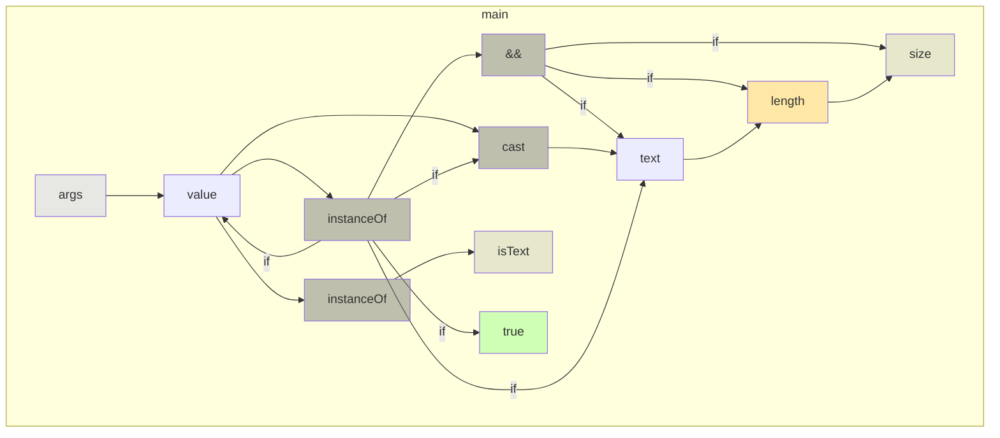

# instanceOf: spike value graph (condensed)

```mermaid
flowchart TD
  subgraph m0["main"]
    n0["&&"]:::BIN_OP
    n1["cast"]:::BIN_OP
    n2["instanceOf"]:::BIN_OP
    n3["instanceOf"]:::BIN_OP
    n4["length"]:::EXTERNAL
    n5["args"]:::FUNC_PARAM
    n6["true"]:::LITERAL
    n7["isText"]:::VARIABLE
    n8["size"]:::VARIABLE
    n9["text"]:::OBJ_VARIABLE
    n10["value"]:::OBJ_VARIABLE
  end
  n0 -->|if| n4
  n0 -->|if| n8
  n0 -->|if| n9
  n1 --> n9
  n10 --> n1
  n10 --> n2
  n10 --> n3
  n2 --> n7
  n3 --> n0
  n3 -->|if| n1
  n3 -->|if| n10
  n3 -->|if| n6
  n3 -->|if| n9
  n4 --> n8
  n5 --> n10
  n9 --> n4
  classDef LITERAL fill:#00FF0030
  classDef VARIABLE fill:#80808030
  classDef BIN_OP fill:#80808080
  classDef FUNC_PARAM fill:#8080FF30
  classDef RETURN fill:#FF808080
  classDef EXTERNAL fill:#FFA50040
  classDef UNMODELLED fill:#FF000030,stroke-dasharray: 4 2
```
