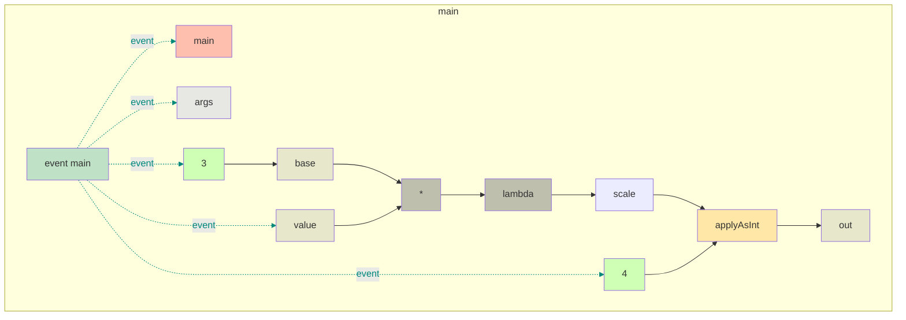

```mermaid
flowchart TD
  subgraph b0["main"]
    n1[event main]:::EVENT
    n2[main]:::RETURN
    n3[args]:::FUNC_PARAM
    n4[3]:::LITERAL
    n5[base]:::VARIABLE
    n6[value]:::VARIABLE
    n7[*]:::BIN_OP
    n8[lambda]:::BIN_OP
    n9[scale]:::OBJ_VARIABLE
    n10[4]:::LITERAL
    n11[applyAsInt]:::EXTERNAL
    n12[out]:::VARIABLE
    n1[event main]:::EVENT -. event .-> n2[main]:::RETURN
    n1[event main]:::EVENT -. event .-> n3[args]:::FUNC_PARAM
    n1[event main]:::EVENT -. event .-> n4[3]:::LITERAL
    n1[event main]:::EVENT -. event .-> n6[value]:::VARIABLE
    n1[event main]:::EVENT -. event .-> n10[4]:::LITERAL
    n4[3]:::LITERAL --> n5[base]:::VARIABLE
    n5[base]:::VARIABLE --> n7[*]:::BIN_OP
    n6[value]:::VARIABLE --> n7[*]:::BIN_OP
    n7[*]:::BIN_OP --> n8[lambda]:::BIN_OP
    n8[lambda]:::BIN_OP --> n9[scale]:::OBJ_VARIABLE
    n9[scale]:::OBJ_VARIABLE --> n11[applyAsInt]:::EXTERNAL
    n10[4]:::LITERAL --> n11[applyAsInt]:::EXTERNAL
    n11[applyAsInt]:::EXTERNAL --> n12[out]:::VARIABLE
  end
  linkStyle 0 stroke:#00897b,color:#00897b
  linkStyle 1 stroke:#00897b,color:#00897b
  linkStyle 2 stroke:#00897b,color:#00897b
  linkStyle 3 stroke:#00897b,color:#00897b
  linkStyle 4 stroke:#00897b,color:#00897b
  classDef LITERAL fill:#00FF0030
  classDef VARIABLE fill:#80808030
  classDef BIN_OP fill:#80808080
  classDef FUNC_PARAM fill:#8080FF30
  classDef RETURN fill:#FF808080
  classDef EXTERNAL fill:#FFA50040
  classDef UNMODELLED fill:#FF000030,stroke-dasharray: 4 2
  classDef EVENT fill:#00897B40
```
