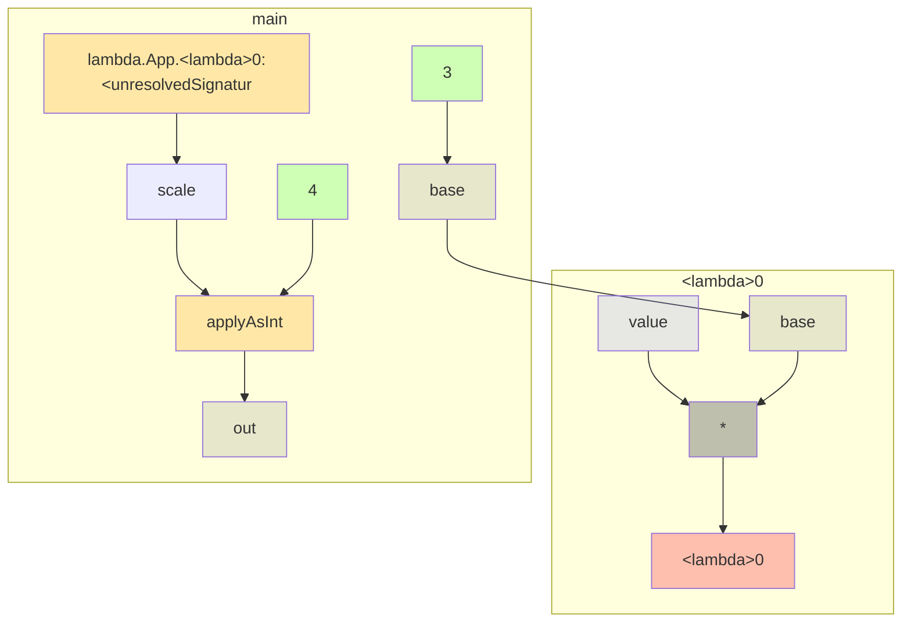

# lambda: spike value graph (condensed)

```mermaid
flowchart TD
  subgraph m0["#lt;lambda#gt;0"]
    n0["*"]:::BIN_OP
    n1["value"]:::FUNC_PARAM
    n2["#lt;lambda#gt;0"]:::RETURN
    n3["base"]:::VARIABLE
  end
  subgraph m1["main"]
    n4["applyAsInt"]:::EXTERNAL
    n5["lambda.App.#lt;lambda#gt;0:#lt;unresolvedSignatur"]:::EXTERNAL
    n6["3"]:::LITERAL
    n7["4"]:::LITERAL
    n8["base"]:::VARIABLE
    n9["out"]:::VARIABLE
    n10["scale"]:::OBJ_VARIABLE
  end
  n0 --> n2
  n1 --> n0
  n10 --> n4
  n3 --> n0
  n4 --> n9
  n5 --> n10
  n6 --> n8
  n7 --> n4
  n8 --> n3
  classDef LITERAL fill:#00FF0030
  classDef VARIABLE fill:#80808030
  classDef BIN_OP fill:#80808080
  classDef FUNC_PARAM fill:#8080FF30
  classDef RETURN fill:#FF808080
  classDef EXTERNAL fill:#FFA50040
  classDef UNMODELLED fill:#FF000030,stroke-dasharray: 4 2
```
