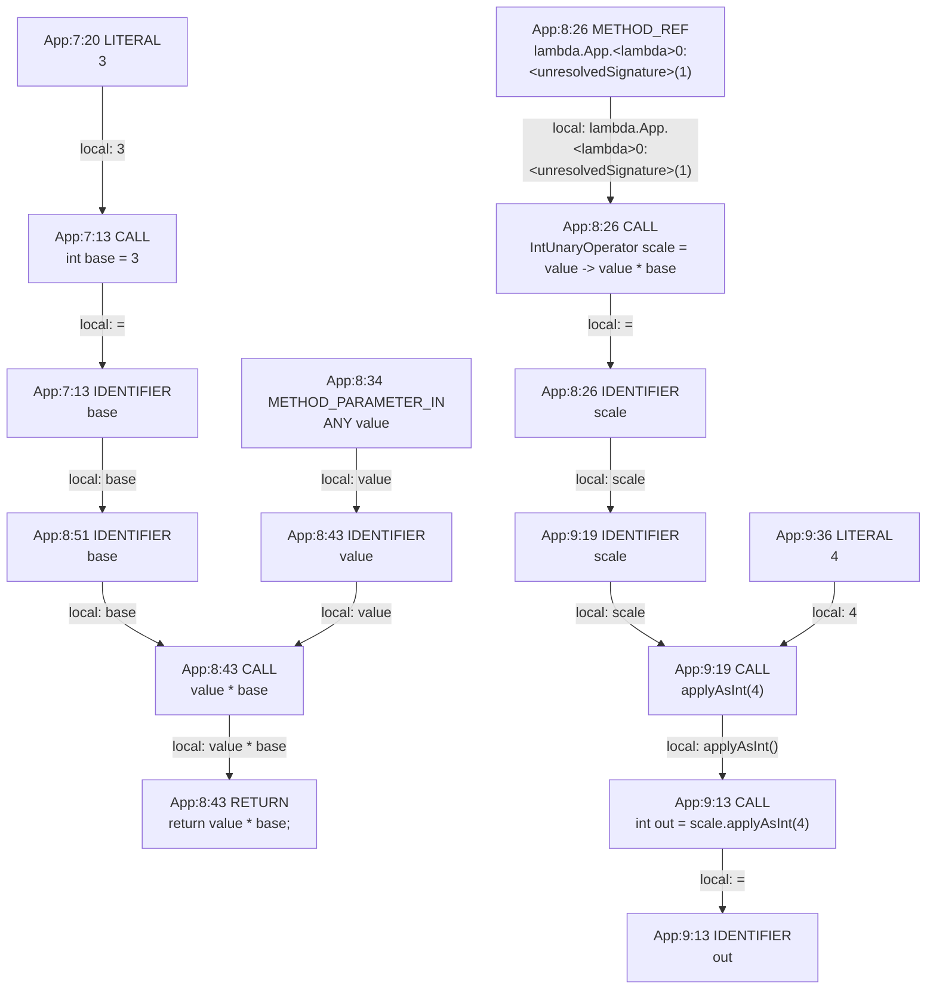

# lambda: spike value graph

```mermaid
flowchart TD
  n0["App:7:13 CALL<br/>int base = 3"]
  n1["App:7:13 IDENTIFIER<br/>base"]
  n2["App:7:20 LITERAL<br/>3"]
  n3["App:8:26 CALL<br/>IntUnaryOperator scale = value -#gt; value * base"]
  n4["App:8:26 IDENTIFIER<br/>scale"]
  n5["App:8:26 METHOD_REF<br/>lambda.App.#lt;lambda#gt;0:#lt;unresolvedSignature#gt;(1)"]
  n6["App:8:34 METHOD_PARAMETER_IN<br/>ANY value"]
  n7["App:8:43 CALL<br/>value * base"]
  n8["App:8:43 IDENTIFIER<br/>value"]
  n9["App:8:43 RETURN<br/>return value * base;"]
  n10["App:8:51 IDENTIFIER<br/>base"]
  n11["App:9:13 CALL<br/>int out = scale.applyAsInt(4)"]
  n12["App:9:13 IDENTIFIER<br/>out"]
  n13["App:9:19 CALL<br/>applyAsInt(4)"]
  n14["App:9:19 IDENTIFIER<br/>scale"]
  n15["App:9:36 LITERAL<br/>4"]
  n0 -->|"local: ="| n1
  n1 -->|"local: base"| n10
  n10 -->|"local: base"| n7
  n11 -->|"local: ="| n12
  n13 -->|"local: applyAsInt()"| n11
  n14 -->|"local: scale"| n13
  n15 -->|"local: 4"| n13
  n2 -->|"local: 3"| n0
  n3 -->|"local: ="| n4
  n4 -->|"local: scale"| n14
  n5 -->|"local: lambda.App.#lt;lambda#gt;0:#lt;unresolvedSignature#gt;(1)"| n3
  n6 -->|"local: value"| n8
  n7 -->|"local: value * base"| n9
  n8 -->|"local: value"| n7
```
