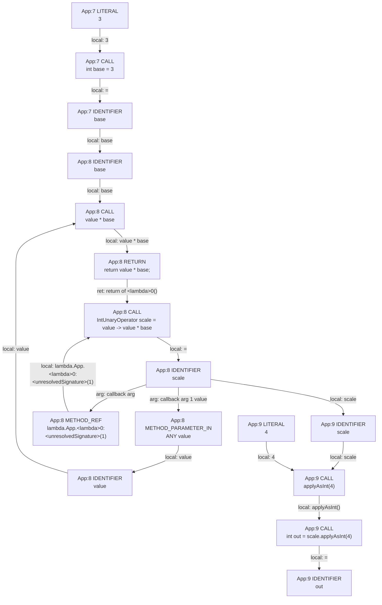

# lambda: spike value graph

```mermaid
flowchart TD
  n0["App:7 CALL<br/>int base = 3"]
  n1["App:7 IDENTIFIER<br/>base"]
  n2["App:7 LITERAL<br/>3"]
  n3["App:8 CALL<br/>IntUnaryOperator scale = value -#gt; value * base"]
  n4["App:8 CALL<br/>value * base"]
  n5["App:8 IDENTIFIER<br/>base"]
  n6["App:8 IDENTIFIER<br/>scale"]
  n7["App:8 IDENTIFIER<br/>value"]
  n8["App:8 METHOD_PARAMETER_IN<br/>ANY value"]
  n9["App:8 METHOD_REF<br/>lambda.App.#lt;lambda#gt;0:#lt;unresolvedSignature#gt;(1)"]
  n10["App:8 RETURN<br/>return value * base;"]
  n11["App:9 CALL<br/>applyAsInt(4)"]
  n12["App:9 CALL<br/>int out = scale.applyAsInt(4)"]
  n13["App:9 IDENTIFIER<br/>out"]
  n14["App:9 IDENTIFIER<br/>scale"]
  n15["App:9 LITERAL<br/>4"]
  n0 -->|"local: ="| n1
  n1 -->|"local: base"| n5
  n10 -->|"ret: return of #lt;lambda#gt;0()"| n3
  n11 -->|"local: applyAsInt()"| n12
  n12 -->|"local: ="| n13
  n14 -->|"local: scale"| n11
  n15 -->|"local: 4"| n11
  n2 -->|"local: 3"| n0
  n3 -->|"local: ="| n6
  n4 -->|"local: value * base"| n10
  n5 -->|"local: base"| n4
  n6 -->|"arg: callback arg 1 value"| n8
  n6 -->|"arg: callback arg"| n9
  n6 -->|"local: scale"| n14
  n7 -->|"local: value"| n4
  n8 -->|"local: value"| n7
  n9 -->|"local: lambda.App.#lt;lambda#gt;0:#lt;unresolvedSignature#gt;(1)"| n3
```
