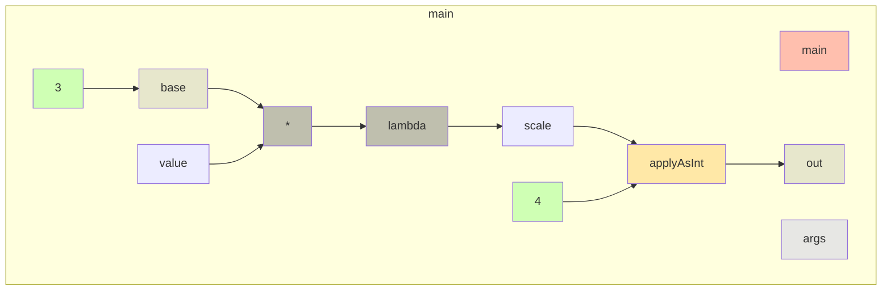

```mermaid
flowchart TD
  subgraph b0["main"]
    n1[main]:::RETURN
    n2[args]:::FUNC_PARAM
    n3[3]:::LITERAL
    n4[base]:::VARIABLE
    n5[value]:::OBJ_VARIABLE
    n6[*]:::BIN_OP
    n7[lambda]:::BIN_OP
    n8[scale]:::OBJ_VARIABLE
    n9[4]:::LITERAL
    n10[applyAsInt]:::EXTERNAL
    n11[out]:::VARIABLE
    n3[3]:::LITERAL --> n4[base]:::VARIABLE
    n4[base]:::VARIABLE --> n6[*]:::BIN_OP
    n5[value]:::OBJ_VARIABLE --> n6[*]:::BIN_OP
    n6[*]:::BIN_OP --> n7[lambda]:::BIN_OP
    n7[lambda]:::BIN_OP --> n8[scale]:::OBJ_VARIABLE
    n8[scale]:::OBJ_VARIABLE --> n10[applyAsInt]:::EXTERNAL
    n9[4]:::LITERAL --> n10[applyAsInt]:::EXTERNAL
    n10[applyAsInt]:::EXTERNAL --> n11[out]:::VARIABLE
  end
  classDef LITERAL fill:#00FF0030
  classDef VARIABLE fill:#80808030
  classDef BIN_OP fill:#80808080
  classDef FUNC_PARAM fill:#8080FF30
  classDef RETURN fill:#FF808080
  classDef EXTERNAL fill:#FFA50040
```
