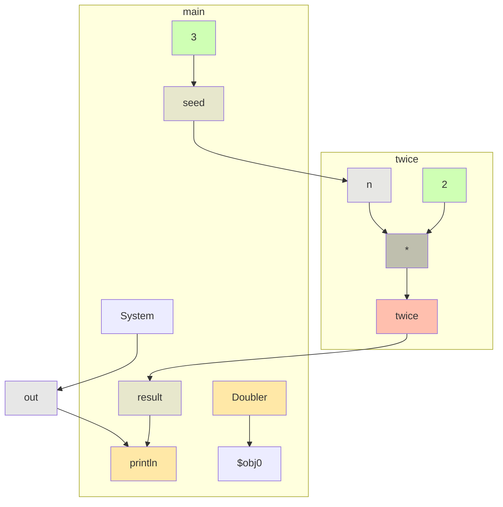

# localClass: spike value graph (condensed)

```mermaid
flowchart TD
  subgraph m0["main"]
    n4["Doubler"]:::EXTERNAL
    n5["println"]:::EXTERNAL
    n6["3"]:::LITERAL
    n7["$obj0"]:::OBJ_VARIABLE
    n8["System"]:::OBJ_VARIABLE
    n9["result"]:::VARIABLE
    n10["seed"]:::VARIABLE
  end
  subgraph m1["twice"]
    n0["*"]:::BIN_OP
    n1["n"]:::FUNC_PARAM
    n2["2"]:::LITERAL
    n3["twice"]:::RETURN
  end
  n11["out"]:::VARIABLE
  n0 --> n3
  n1 --> n0
  n10 --> n1
  n11 --> n5
  n2 --> n0
  n3 --> n9
  n4 --> n7
  n6 --> n10
  n8 --> n11
  n9 --> n5
  classDef LITERAL fill:#00FF0030
  classDef VARIABLE fill:#80808030
  classDef BIN_OP fill:#80808080
  classDef FUNC_PARAM fill:#8080FF30
  classDef RETURN fill:#FF808080
  classDef EXTERNAL fill:#FFA50040
  classDef UNMODELLED fill:#FF000030,stroke-dasharray: 4 2
```
