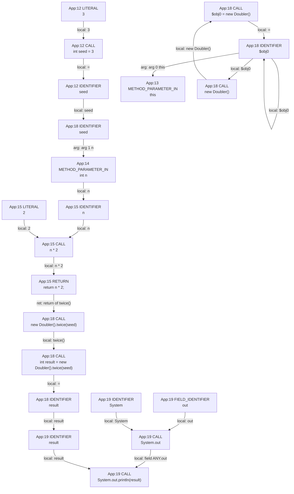

# localClass: spike value graph

```mermaid
flowchart TD
  n0["App:12 CALL<br/>int seed = 3"]
  n1["App:12 IDENTIFIER<br/>seed"]
  n2["App:12 LITERAL<br/>3"]
  n3["App:13 METHOD_PARAMETER_IN<br/>this"]
  n4["App:14 METHOD_PARAMETER_IN<br/>int n"]
  n5["App:15 CALL<br/>n * 2"]
  n6["App:15 IDENTIFIER<br/>n"]
  n7["App:15 LITERAL<br/>2"]
  n8["App:15 RETURN<br/>return n * 2;"]
  n9["App:18 CALL<br/>$obj0 = new Doubler()"]
  n10["App:18 CALL<br/>int result = new Doubler().twice(seed)"]
  n11["App:18 CALL<br/>new Doubler()"]
  n12["App:18 CALL<br/>new Doubler().twice(seed)"]
  n13["App:18 IDENTIFIER<br/>$obj0"]
  n14["App:18 IDENTIFIER<br/>result"]
  n15["App:18 IDENTIFIER<br/>seed"]
  n16["App:19 CALL<br/>System.out"]
  n17["App:19 CALL<br/>System.out.println(result)"]
  n18["App:19 FIELD_IDENTIFIER<br/>out"]
  n19["App:19 IDENTIFIER<br/>System"]
  n20["App:19 IDENTIFIER<br/>result"]
  n0 -->|"local: ="| n1
  n1 -->|"local: seed"| n15
  n10 -->|"local: ="| n14
  n11 -->|"local: new Doubler()"| n9
  n12 -->|"local: twice()"| n10
  n13 -->|"arg: arg 0 this"| n3
  n13 -->|"local: $obj0"| n11
  n13 -->|"local: $obj0"| n13
  n14 -->|"local: result"| n20
  n15 -->|"arg: arg 1 n"| n4
  n16 -->|"local: field ANY.out"| n17
  n18 -->|"local: out"| n16
  n19 -->|"local: System"| n16
  n2 -->|"local: 3"| n0
  n20 -->|"local: result"| n17
  n4 -->|"local: n"| n6
  n5 -->|"local: n * 2"| n8
  n6 -->|"local: n"| n5
  n7 -->|"local: 2"| n5
  n8 -->|"ret: return of twice()"| n12
  n9 -->|"local: ="| n13
```
